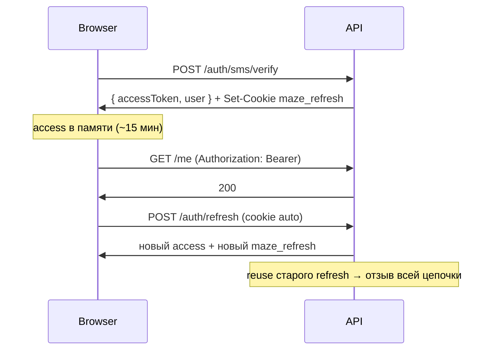
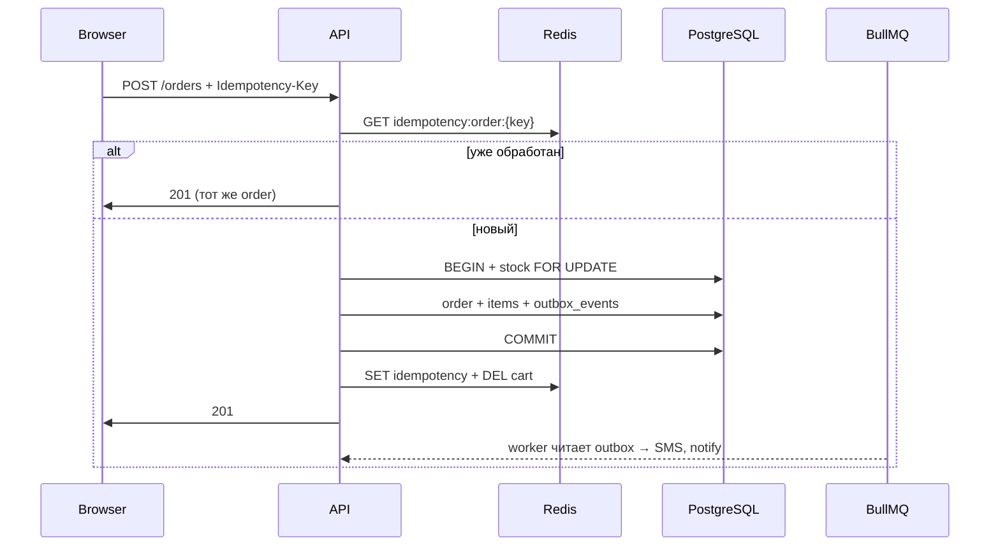

# MAZE — API Contract (web-only)

> **Статус:** ✅ production-contract (финал перед реализацией)  
> **Клиент:** Next.js (browser only, без mobile app)  
> **Base URL:** `https://api.maze.ru/api/v1` · dev: `http://localhost:4000/api/v1`  
> **Версия:** 1.1 · июнь 2026 (production-contract)  
> **Связанные документы:** [BACKEND_ARCHITECTURE.md](BACKEND_ARCHITECTURE.md) · [DATABASE_ARCHITECTURE.md](DATABASE_ARCHITECTURE.md) · [CLIENT_DECISIONS.md](CLIENT_DECISIONS.md) · [CLIENT_ARCHITECTURE.md](CLIENT_ARCHITECTURE.md)

---

## Содержание

1. [Scope](#scope)
2. [Общие правила](#общие-правила)
3. [Cookies и auth](#cookies-и-auth)
4. [CSRF](#csrf)
5. [Rate limits](#rate-limits)
6. [Формат ответов и ошибок](#формат-ответов-и-ошибок)
7. [Коды ошибок](#коды-ошибок)
8. [Эндпоинты](#эндпоинты)
9. [Checkout и идемпотентность](#checkout-и-идемпотентность)
10. [Интеграция с фронтом](#интеграция-с-фронтом)
11. [Чеклист разработки](#чеклист-разработки)

---

## Scope

### В scope (web-only)

- Один browser-клиент: Next.js
- Refresh-токены **только** в HttpOnly cookies
- Access-токен **только** в памяти фронта (React state / Zustand)
- Cookie `maze_guest` хранит **sessionId**; сама корзина — в Redis (см. [Гостевая корзина](#гостевая-корзина))
- Staff-сессии отдельно: `maze_staff_refresh`
- `credentials: 'include'` для запросов с cookies

### Вне scope (навсегда для MVP)

- Mobile app, token exchange, refresh в body
- localStorage / sessionStorage для JWT
- Push / device tokens, deep-link auth
- Отдельные app-only rate limits и payloads

---

## Общие правила

### Версионирование

Все эндпоинты под префиксом `/api/v1`.

### Заголовки

| Header | Обязательность | Описание |
|--------|----------------|----------|
| `Content-Type: application/json` | POST/PATCH/PUT | Кроме upload |
| `Authorization: Bearer <access>` | User/staff endpoints | Access JWT из памяти |
| `X-Requested-With: maze-web` | POST/PATCH/DELETE | CSRF-защита |
| `Idempotency-Key: <uuid-v4>` | `POST /orders` | Обязательно |
| `X-Request-Id` | Опционально | Клиент может передать; иначе сервер генерирует |

### Формат ответов (финал)

**Успех:** `{ "data": T, "requestId": "..." }` — `data` **всегда** есть.  
**Список:** дополнительно `{ "meta": { "page", "limit", "total" } }`.  
**Ошибка:** `{ "error": { "code", "message", "details": [] }, "requestId": "..." }` — `details` **всегда массив**.

`requestId`: см. формулу в [IMPLEMENTATION_DECISIONS.md](IMPLEMENTATION_DECISIONS.md) — `correlationId = requestId`.

### CORS

```
Access-Control-Allow-Origin: https://maze.ru  (dev: http://localhost:3000)
Access-Control-Allow-Credentials: true
Access-Control-Allow-Headers: Content-Type, Authorization, X-Requested-With, Idempotency-Key, X-Request-Id
```

### Нормализация (до service-слоя)

- Телефон → `+7XXXXXXXXXX`
- Email → lowercase, trim
- Строки → trim
- `page` ≥ 1, `limit` 1–48 (default 24)
- Корзина: max **30** позиций, max **10** шт. на variant

### Цены

Клиент **никогда** не передаёт цены на write-path. Сервер читает актуальные цены из БД и сохраняет snapshot в `order_items` + `pricing_version` в `orders`.

---

## Cookies и auth

### Cookies

| Cookie | Назначение | Flags | Path | Max-Age |
|--------|------------|-------|------|---------|
| `maze_guest` | UUID **sessionId** гостя (не корзина!) | HttpOnly; Secure; **SameSite=Lax** | `/` | 7 дней |
| `maze_refresh` | User refresh token | HttpOnly; Secure; **SameSite=Strict** | `/api/v1/auth` | 7 дней |
| `maze_staff_refresh` | Staff refresh token | HttpOnly; Secure; **SameSite=Strict** | `/api/v1/auth/staff` | 7 дней |

**Production:** `Domain=.maze.ru` на всех cookie.  
**Development:** Domain не задаётся (host-only, `localhost:3000` + `localhost:4000`).  
Подробнее: [IMPLEMENTATION_DECISIONS.md](IMPLEMENTATION_DECISIONS.md) § Cookie-policy.

### Auth endpoints

| Method | Path | Cookie | Bearer | Описание |
|--------|------|--------|--------|----------|
| POST | `/auth/sms/send` | — | — | Отправка OTP |
| POST | `/auth/sms/verify` | Set `maze_refresh` | — | Вход в ЛК |
| POST | `/auth/refresh` | `maze_refresh` | — | Новый access + rotation refresh |
| POST | `/auth/logout` | `maze_refresh` | опц. | Отзыв сессии |
| POST | `/auth/staff/login` | Set `maze_staff_refresh` | — | Вход менеджера/админа |
| POST | `/auth/staff/logout` | `maze_staff_refresh` | опц. | Выход staff |

### Auth flow



### Гость vs пользователь

| Действие | Идентификация |
|----------|---------------|
| Каталог, CMS, home | без auth |
| Корзина | `maze_guest` или Bearer user |
| Checkout | `maze_guest` + телефон **без OTP** |
| ЛК, избранное, мои заказы | Bearer user |
| После `sms/verify` | merge `cart:guest:{sessionId}` → `cart:user:{userId}` |

### Гостевая корзина

Cookie и Redis — **разные слои**. Корзина никогда не хранится в cookie.

| Слой | Ключ / cookie | Содержимое |
|------|---------------|------------|
| Browser | `maze_guest` | UUID `sessionId` |
| Redis | `cart:guest:{sessionId}` | `[{ variantId, quantity, addedAt }]` |
| Redis | `cart:user:{userId}` | Корзина авторизованного пользователя |

**Первый визит:** если `maze_guest` нет — сервер генерирует `sessionId`, ставит cookie, создаёт пустую корзину в Redis (TTL 7 дней).

**Merge при `POST /auth/sms/verify`:**
1. Прочитать `sessionId` из `maze_guest`
2. Загрузить `cart:guest:{sessionId}` и `cart:user:{userId}`
3. Объединить позиции (суммировать `quantity`, соблюдать лимиты 30 / 10)
4. Записать в `cart:user:{userId}`, удалить `cart:guest:{sessionId}`

---

## CSRF

### MVP (достаточно для web-only Next.js)

На всех `POST` / `PATCH` / `DELETE`:
- `SameSite=Strict` на refresh-cookies
- Strict CORS + `credentials: 'include'`
- Обязательный header `X-Requested-With: maze-web`

Это **допустимая базовая защита** для same-origin SPA: `SameSite` снижает риск CSRF, custom header добавляет второй барьер при корректном CORS. Header сам по себе не является криптографической защитой, но в связке с CORS whitelist — рабочее MVP-решение.

Сервер отклоняет mutating-запросы без header → `403 CSRF_VALIDATION_FAILED`.

### Фаза 2 (критичные mutation-ручки)

Double-submit: readable cookie `maze_csrf` + header `X-CSRF-Token`.

Приоритет для включения:
- `POST /orders`
- `PATCH /me/consents`
- staff/admin mutations

---

## Rate limits

| Сценарий | Лимит | Ключ |
|----------|-------|------|
| OTP send | 3 / 15 мин | phone |
| OTP send | 10 / 15 мин | IP |
| OTP verify | 10 / 15 мин | phone |
| Refresh | 30 / 15 мин | userId |
| Staff login | 5 / 15 мин | email + IP |
| Checkout | 5 / час | userId или guest session |
| Delivery quote | 20 / час | IP |
| Catalog search/filter | 60 / мин | IP |
| Общий GET | 300 / мин | IP |
| Manager/Admin | 600 / мин | staffId |

При превышении: `429 RATE_LIMIT_EXCEEDED` + заголовок `Retry-After`.

### Anti-enumeration

- `POST /auth/sms/send` — всегда `200`, одинаковое сообщение
- `GET /me/orders/:id`, addresses, favorites — `404` и для «чужого», и для «нет»

---

## Формат ответов и ошибок

### Успех

```json
{
  "data": {},
  "meta": { "page": 1, "limit": 24, "total": 142 },
  "requestId": "req_01HZXK3N2Q"
}
```

`meta` — только для пагинированных списков.

### Ошибка

```json
{
  "error": {
    "code": "VALIDATION_ERROR",
    "message": "Некорректный номер телефона",
    "details": [{ "field": "phone", "message": "Ожидается +7XXXXXXXXXX" }]
  },
  "requestId": "req_01HZXK3N2Q"
}
```

В production: без stack trace, SQL, имён таблиц.

### HTTP-статусы

| HTTP | Когда |
|------|-------|
| 200 | Успех (GET, PATCH, DELETE) |
| 201 | Создано (POST /orders) |
| 400 | Валидация |
| 401 | Нет / истёк access |
| 403 | Нет прав, CSRF, role |
| 404 | Не найдено (в т.ч. IDOR) |
| 409 | Конфликт бизнес-состояния — **всегда смотреть `error.code`** |
| 429 | Rate limit |
| 500 | Внутренняя ошибка |

---

## Коды ошибок

Фронт **не должен** различать сценарии по HTTP-статусу. Для UX используется только `error.code`.

### Все коды

| Code | HTTP | Описание |
|------|------|----------|
| `VALIDATION_ERROR` | 400 | Zod / бизнес-валидация |
| `UNAUTHORIZED` | 401 | Нет или невалидный access |
| `TOKEN_EXPIRED` | 401 | Access истёк → refresh |
| `FORBIDDEN` | 403 | Нет прав |
| `CSRF_VALIDATION_FAILED` | 403 | Нет X-Requested-With |
| `NOT_FOUND` | 404 | Ресурс не найден |
| `ORDER_OUT_OF_STOCK` | 409 | Недостаточно на складе |
| `CART_LIMIT_EXCEEDED` | 409 | > 30 позиций или > 10 qty |
| `QUOTE_EXPIRED` | 409 | delivery quote истёк (`expiresAt < now`) |
| `QUOTE_INVALID` | 409 | quote не соответствует корзине / provider |
| `IDEMPOTENCY_CONFLICT` | 409 | Тот же ключ, другой payload |
| `DUPLICATE_RESOURCE` | 409 | Нарушение UNIQUE (редко) |
| `RATE_LIMIT_EXCEEDED` | 429 | Превышен лимит |
| `INTERNAL_ERROR` | 500 | Непредвиденная ошибка |

### HTTP 409 — conflict handling

Все конфликты возвращают **409**, но семантика — в `error.code`:

| `error.code` | Когда | Действие на фронте |
|--------------|-------|-------------------|
| `ORDER_OUT_OF_STOCK` | `quantity - reserved < нужное` | «Товар закончился», обновить корзину |
| `CART_LIMIT_EXCEEDED` | Превышен лимит позиций/qty | Показать лимит, предложить уменьшить |
| `QUOTE_EXPIRED` | `delivery_quotes.expires_at < now()` | «Пересчитайте доставку» → `POST /delivery/quote` |
| `QUOTE_INVALID` | quote не найден или не совпадает с корзиной | Пересчитать доставку |
| `IDEMPOTENCY_CONFLICT` | Тот же `Idempotency-Key`, другой body | Ошибка клиента, не повторять слепо |
| `DUPLICATE_RESOURCE` | UNIQUE constraint в БД | Общее сообщение о конфликте |

В коде бэкенда: один класс `ConflictError` с полем `code`, не разные HTTP-статусы под каждый случай.

---

## Эндпоинты

### Health

#### `GET /health/live`

Liveness. Без auth.

**Response 200:** `{ "data": { "status": "ok" } }`

#### `GET /health/ready`

Readiness: PostgreSQL + Redis.

**Response 200:** `{ "data": { "status": "ready", "postgres": true, "redis": true } }`  
**Response 503:** если зависимость недоступна

---

### Public

#### `GET /settings/public`

Контакты, адрес магазина, часы, соцсети, карта.

**Response `data`:**
```json
{
  "storeName": "MAZE",
  "address": "Санкт-Петербург, ул. Чайковского, 56",
  "phone": "+78121234567",
  "email": "info@maze.ru",
  "workingHours": "10:00–21:00",
  "socialLinks": { "telegram": "", "vk": "" },
  "mapCoordinates": { "lat": 59.94, "lng": 30.33 }
}
```

#### `GET /home`

Главная: editor's choice, баннеры, слайды, преимущества, партнёры.

**Cache:** Redis, TTL 5–10 мин.

#### `GET /reviews?page=1&limit=20`

Витринные отзывы (Авито, Яндекс, 2ГИС).

#### `GET /cms/:slug`

CMS-страница (`about`, `delivery`, `warranty`, …).

---

### Catalog

#### `GET /catalog/categories`

Дерево категорий. Корневые узлы с `isBrand: true` — бренды.

**Response item:**
```json
{
  "id": "uuid",
  "slug": "apple",
  "name": "Apple",
  "isBrand": true,
  "brandLogoUrl": "https://cdn.../apple.svg",
  "children": [{ "id": "uuid", "slug": "iphone", "name": "iPhone" }]
}
```

#### `GET /catalog/products`

**Query:**

| Param | Тип | Описание |
|-------|-----|----------|
| `category` | string | slug категории |
| `brand` | string | slug бренда |
| `priceMin` | number | |
| `priceMax` | number | |
| `memory` | string | |
| `color` | string | |
| `inStock` | boolean | |
| `sort` | enum | `price_asc`, `price_desc`, `newest` |
| `page` | number | default 1 |
| `limit` | number | default 24, max 48 |

**Response item (список):**
```json
{
  "id": "uuid",
  "slug": "iphone-16-pro",
  "title": "iPhone 16 Pro",
  "brandName": "Apple",
  "priceFrom": 129990,
  "oldPriceFrom": 139990,
  "mainImageUrl": "https://cdn.../1.jpg",
  "inStock": true,
  "badges": ["new"]
}
```

#### `GET /catalog/products/:slug`

Полная карточка: images, features, specs (EAV), variants.

**Response `data.variants[]`:**
```json
{
  "id": "uuid",
  "sku": "IP16P-256-BLK",
  "memory": "256GB",
  "color": "Black",
  "price": 129990,
  "oldPrice": 139990,
  "inStock": true,
  "quantityAvailable": 5
}
```

---

### Delivery

#### `POST /delivery/quote`

Расчёт доставки. **Асинхронно:** при miss кэша — job в BullMQ.

**Body:**
```json
{
  "provider": "pickup|spb_courier|spb_yandex|rf_cdek|rf_yandex",
  "city": "Санкт-Петербург",
  "address": {
    "street": "Невский пр.",
    "house": "1",
    "flat": "10",
    "postalCode": "190000"
  },
  "items": [{ "variantId": "uuid", "quantity": 1 }]
}
```

**Response:**
```json
{
  "data": {
    "quoteId": "uuid",
    "status": "ready|pending|failed",
    "priceRub": 590,
    "etaDays": 1,
    "expiresAt": "2026-06-23T18:00:00Z"
  }
}
```

**TTL:** quote хранится в `delivery_quotes` + Redis. Default TTL — **15 мин** с момента `ready`.

**Правила checkout (обязательно на сервере):**

| Условие | Ответ |
|---------|-------|
| `quoteId` не найден | `404 NOT_FOUND` |
| `expires_at < now()` | `409 QUOTE_EXPIRED` — заказ **не создаётся** |
| quote не соответствует текущей корзине / provider | `409 QUOTE_INVALID` |
| quote валиден | цена доставки берётся **только из quote**, клиент не передаёт `deliveryPrice` |

Протухший quote → пользователь вызывает `POST /delivery/quote` заново.

#### `GET /delivery/quote/:quoteId`

Poll результата job. Auth: guest cookie или user.

---

### Cart

Все эндпоинты: `credentials: 'include'`.

**Идентификация:** Bearer user → Redis `cart:user:{userId}`; иначе cookie `maze_guest` → Redis `cart:guest:{sessionId}` (см. [Гостевая корзина](#гостевая-корзина)).

#### `GET /cart`

**Response:**
```json
{
  "data": {
    "items": [{
      "variantId": "uuid",
      "productId": "uuid",
      "slug": "iphone-16-pro",
      "title": "iPhone 16 Pro",
      "variantLabel": "256GB / Black",
      "quantity": 1,
      "unitPrice": 129990,
      "lineTotal": 129990,
      "maxQuantity": 10,
      "inStock": true
    }],
    "summary": {
      "itemsCount": 1,
      "subtotalRub": 129990,
      "limits": { "maxLines": 30, "maxQtyPerLine": 10 }
    }
  }
}
```

#### `PUT /cart`

Replace all. Body: `{ "items": [{ "variantId": "uuid", "quantity": 1 }] }`

#### `POST /cart/items`

Body: `{ "variantId": "uuid", "quantity": 1 }`

#### `DELETE /cart/items/:variantId`

#### `DELETE /cart`

---

### Auth

#### `POST /auth/sms/send`

**Body:** `{ "phone": "+79161234567" }`

**Response 200 (всегда):**
```json
{
  "data": { "message": "Если номер корректен, код отправлен" }
}
```

SMS уходит через BullMQ job, не синхронно в HTTP.

#### `POST /auth/sms/verify`

**Body:** `{ "phone": "+79161234567", "code": "123456" }`

**Response 200:**
```json
{
  "data": {
    "accessToken": "eyJ...",
    "expiresIn": 900,
    "user": {
      "id": "uuid",
      "phone": "+79161234567",
      "firstName": null,
      "lastName": null
    }
  }
}
```

+ `Set-Cookie: maze_refresh=...; HttpOnly; Secure; SameSite=Strict`

Side-effect: merge гостевой корзины в user cart.

#### `POST /auth/refresh`

Только cookie `maze_refresh`. Без body.

**Response 200:**
```json
{
  "data": {
    "accessToken": "eyJ...",
    "expiresIn": 900
  }
}
```

+ новый `maze_refresh` (rotation). Reuse старого → отзыв цепочки.

#### `POST /auth/logout`

Clear cookie + revoke в Redis.

#### `POST /auth/staff/login`

**Body:** `{ "email": "manager@maze.ru", "password": "..." }`

**Response:** `{ "data": { "accessToken", "expiresIn", "staff": { "id", "role": "manager|admin" } } }`  
+ `Set-Cookie: maze_staff_refresh`

#### `POST /auth/staff/logout`

---

### User (Bearer access)

#### `GET /me`

#### `PATCH /me`

**Body:** `{ "firstName", "lastName", "email", "subscribeEmail", "subscribeSms" }`  
При изменении подписок → запись в `user_consents`.

#### `GET|POST /me/addresses`

#### `PATCH|DELETE /me/addresses/:id`

**Address body:**
```json
{
  "type": "home|work",
  "city": "Санкт-Петербург",
  "street": "Невский пр.",
  "house": "1",
  "flat": "10",
  "isDefault": true
}
```

#### `GET|POST|PATCH|DELETE /me/companies`

B2B: ИНН, название, адрес.

#### `GET /me/favorites`

#### `POST /me/favorites/:productId`

#### `DELETE /me/favorites/:productId`

#### `PATCH /me/consents`

**Body:** `{ "subscribeEmail": true, "subscribeSms": false, "source": "profile" }`

#### `GET /me/orders?page&limit`

#### `GET /me/orders/:id`

IDOR-safe: только свой `user_id`.

---

### Orders

#### `POST /orders`

Checkout. **Обязательные headers:** `Idempotency-Key`, `X-Requested-With`.  
**Auth:** `maze_guest` cookie и/или Bearer (если залогинен).

**Body:**
```json
{
  "customer": {
    "phone": "+79161234567",
    "firstName": "Иван",
    "lastName": "Петров",
    "email": "ivan@example.com"
  },
  "delivery": {
    "quoteId": "uuid",
    "comment": "Позвонить за час"
  },
  "payment": {
    "method": "cash|card_qr|installment|invoice_b2b"
  },
  "installmentBundle": {
    "accessoryVariantIds": ["uuid", "uuid", "uuid"]
  },
  "companyId": null,
  "comment": "Комментарий к заказу"
}
```

Сервер:
1. Читает корзину из Redis (`cart:user:{userId}` или `cart:guest:{sessionId}`)
2. Валидирует `delivery.quoteId` (см. [правила TTL](#delivery))
3. Считает цены, наценки (+7% card_qr, +5000₽ installment), доставку из quote
4. Транзакция: stock lock → order + items snapshot → outbox event
5. Очищает корзину в Redis
6. Worker: SMS, notify manager (через outbox → BullMQ)

**Response 201:**
```json
{
  "data": {
    "orderId": "uuid",
    "orderNumber": "MZ-10482",
    "status": "pending",
    "totals": {
      "subtotalRub": 129990,
      "deliveryRub": 590,
      "paymentFeeRub": 0,
      "installmentFeeRub": 0,
      "totalRub": 130580
    },
    "pricingVersion": "v1.2026-06"
  }
}
```

Повтор с тем же `Idempotency-Key` → **тот же 201**, без второго заказа.

---

### Manager (Bearer staff, role: manager|admin)

#### `GET /manager/orders?status&page&limit&assignedTo=me|all`

#### `GET /manager/orders/:id`

#### `PATCH /manager/orders/:id/status`

**Body:** `{ "status": "confirmed|awaiting_payment|paid|shipping|delivered|cancelled", "comment": "..." }`

При `paid`: списание stock + outbox `order.paid`.

#### `POST /manager/orders/:id/notes`

**Body:** `{ "text": "Согласовали доставку на пятницу" }`

#### `PATCH /manager/orders/:id/assign` (admin only)

**Body:** `{ "managerId": "uuid" }`

---

### Admin (Bearer staff, role: admin)

| Method | Path | Описание |
|--------|------|----------|
| CRUD | `/admin/categories` | Дерево + бренды |
| CRUD | `/admin/products` | Товары |
| CRUD | `/admin/products/:id/variants` | Варианты |
| PATCH | `/admin/products/:id/stock` | `{ "quantity": 10 }` |
| PUT | `/admin/editor-choice` | 8–12 товаров |
| CRUD | `/admin/banners` | |
| CRUD | `/admin/info-slides` | |
| CRUD | `/admin/cms-pages` | |
| PATCH | `/admin/site-settings` | |
| POST | `/admin/uploads` | multipart, max 5 MB |

После mutating admin-операций — инвалидация Redis-кэша каталога/главной.

---

## Checkout и идемпотентность



---

## Интеграция с фронтом

### API client (пример)

```typescript
const API_URL = process.env.NEXT_PUBLIC_API_URL;

async function api<T>(
  path: string,
  options: RequestInit & { accessToken?: string } = {}
): Promise<T> {
  const { accessToken, ...init } = options;
  const headers: HeadersInit = {
    'Content-Type': 'application/json',
    'X-Requested-With': 'maze-web',
    ...(accessToken ? { Authorization: `Bearer ${accessToken}` } : {}),
    ...(init.headers ?? {}),
  };

  const res = await fetch(`${API_URL}${path}`, {
    ...init,
    headers,
    credentials: 'include',
  });

  const body = await res.json();
  if (!res.ok) {
    // UX только по error.code, не по HTTP-статусу
    throw new ApiError(body.error.code, body.error.message, body.requestId);
  }
  return body;
}
```

### Refresh при 401

1. `POST /auth/refresh` с `credentials: 'include'`
2. Сохранить новый `accessToken` в store
3. Повторить исходный запрос один раз

### Checkout

```typescript
await api('/orders', {
  method: 'POST',
  accessToken,
  headers: { 'Idempotency-Key': crypto.randomUUID() },
  body: JSON.stringify(checkoutPayload),
});
```

---

## Чеклист разработки

### Security (каждый PR)

- [ ] Zod на body / query / params
- [ ] Нормализация до service
- [ ] IDOR: `WHERE user_id = req.user.id`
- [ ] Rate limit на новый write-endpoint
- [ ] `X-Requested-With` на mutating routes
- [ ] Нет цен с клиента на write-path
- [ ] `requestId` в логах и ответах
- [ ] Ошибки без stack / SQL в production

### Performance

- [ ] Read-path: Redis или обоснование miss
- [ ] Пагинация, limit ≤ 48
- [ ] Нет N+1 в Sequelize
- [ ] Write-path: транзакция < 200 ms target
- [ ] Внешние API только через BullMQ

### Orders (обязательно)

- [ ] `Idempotency-Key`
- [ ] `SELECT FOR UPDATE` на stock
- [ ] Snapshot + `pricing_version`
- [ ] `outbox_events` в той же транзакции

---

## Сводка эндпоинтов (~45)

```
GET    /health/live
GET    /health/ready
GET    /settings/public
GET    /home
GET    /reviews
GET    /cms/:slug
GET    /catalog/categories
GET    /catalog/products
GET    /catalog/products/:slug
POST   /delivery/quote
GET    /delivery/quote/:quoteId
GET    /cart
PUT    /cart
POST   /cart/items
DELETE /cart/items/:variantId
DELETE /cart
POST   /auth/sms/send
POST   /auth/sms/verify
POST   /auth/refresh
POST   /auth/logout
POST   /auth/staff/login
POST   /auth/staff/logout
GET    /me
PATCH  /me
GET|POST /me/addresses
PATCH|DELETE /me/addresses/:id
GET|POST /me/companies
PATCH|DELETE /me/companies/:id
GET    /me/favorites
POST   /me/favorites/:productId
DELETE /me/favorites/:productId
PATCH  /me/consents
GET    /me/orders
GET    /me/orders/:id
POST   /orders
GET    /manager/orders
GET    /manager/orders/:id
PATCH  /manager/orders/:id/status
POST   /manager/orders/:id/notes
PATCH  /manager/orders/:id/assign
CRUD   /admin/*
```

---

*Следующий шаг: scaffold `backend/` по [BACKEND_ARCHITECTURE.md](BACKEND_ARCHITECTURE.md).*
