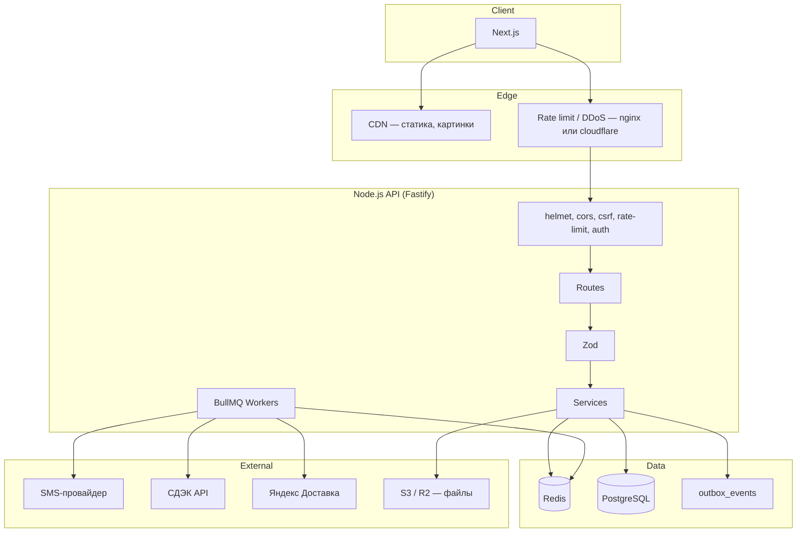
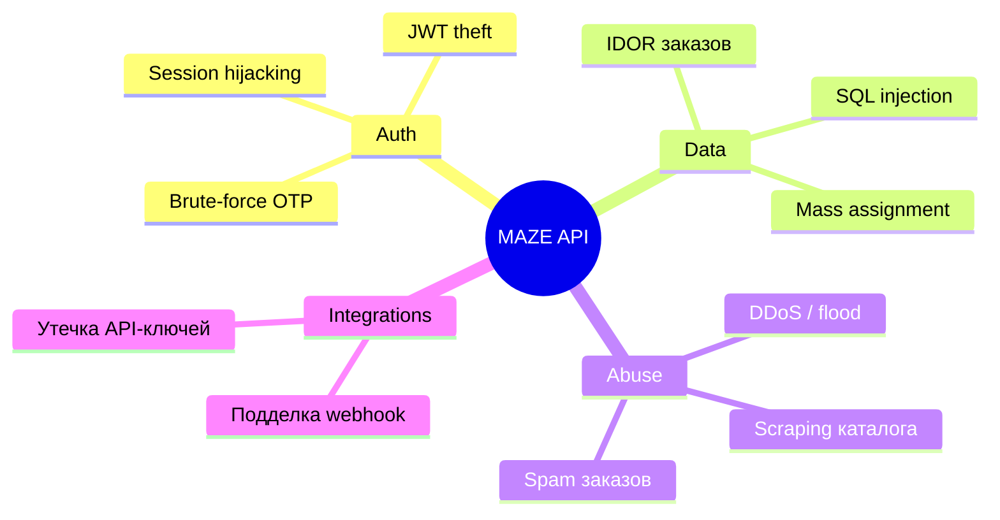
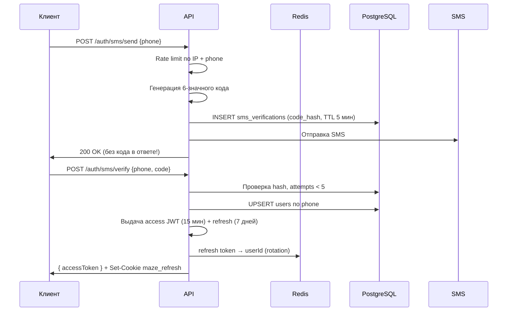
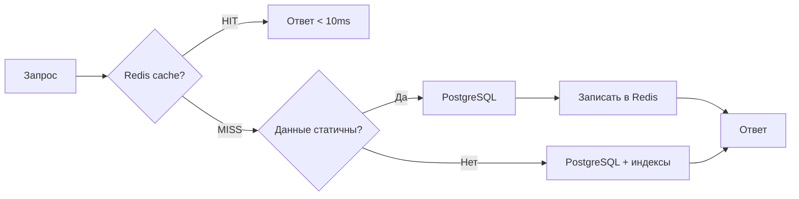
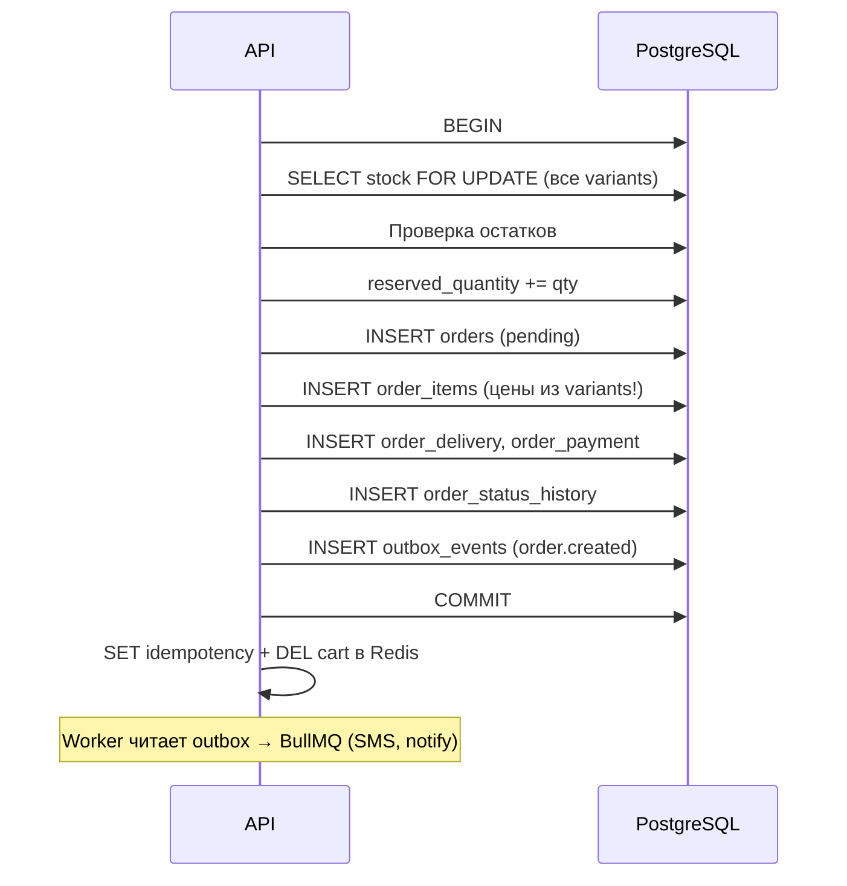
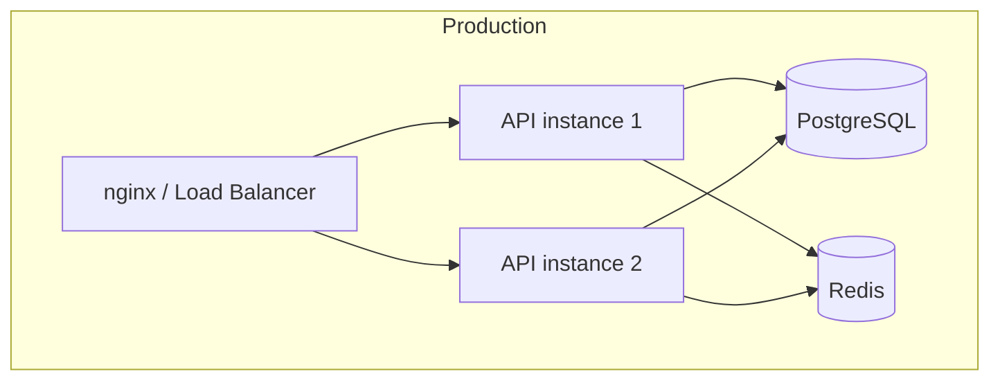

# MAZE — Архитектура бэкенда

> **Статус:** ✅ утверждено  
> **Клиент:** web-only (Next.js browser)  
> **Стек:** Node.js · Fastify · Sequelize · PostgreSQL · Redis · BullMQ  
> **Приоритеты:** безопасность · скорость ответа · предсказуемость  
> **Версия:** 2.1 · июнь 2026  
> **Связанные документы:** [Архитектура БД](DATABASE_ARCHITECTURE.md) · [API Contract](API_CONTRACT.md) · [Решения до кода](IMPLEMENTATION_DECISIONS.md)

---

## Содержание

1. [Цели и SLA](#цели-и-sla)
2. [Общая схема](#общая-схема)
3. [Структура проекта](#структура-проекта)
4. [Безопасность](#безопасность)
5. [Производительность](#производительность)
6. [API](#api)
7. [Аутентификация](#аутентификация)
8. [Кэширование](#кэширование)
9. [Заказы и транзакции](#заказы-и-транзакции)
10. [Интеграции](#интеграции)
11. [Логирование и мониторинг](#логирование-и-мониторинг)
12. [Деплой](#деплой)
13. [Чеклист перед production](#чеклист-перед-production)
14. [Решения до кода](#решения-до-кода)

---

## Цели и SLA

| Метрика | Цель (MVP) |
|---------|------------|
| Каталог / главная (кэш) | **< 100 ms** p95 |
| Карточка товара (кэш) | **< 150 ms** p95 |
| Фильтры каталога | **< 200 ms** p95 |
| Создание заказа | **< 500 ms** p95 |
| OTP send/verify | **< 300 ms** p95 (без SMS-провайдера) |
| Uptime | **99.5%+** |

---

## Общая схема



### Почему Fastify, а не Express

| | Fastify | Express |
|--|---------|---------|
| Скорость | Выше (меньше overhead) | Стандарт де-факто |
| Валидация | Встроенная JSON Schema | Вручную |
| TypeScript | Хорошая поддержка | Хорошая |

**Решение:** Fastify 4+ для API. Если команда привыкла к Express — допустимо, но сохраняем те же middleware и SLA.

---

## Структура проекта

```
backend/
├── src/
│   ├── app.js                 # Fastify instance, plugins
│   ├── server.js              # Entry point
│   ├── config/
│   │   ├── env.js             # Валидация env через Zod
│   │   ├── database.js
│   │   └── redis.js
│   ├── models/                # Sequelize models + index.js
│   ├── migrations/
│   ├── seeders/
│   ├── routes/
│   │   ├── public/            # Каталог, контент (без auth)
│   │   ├── auth/              # SMS OTP
│   │   ├── user/              # ЛК, избранное, адреса
│   │   ├── orders/            # Оформление, мои заказы
│   │   ├── manager/           # Панель менеджера
│   │   └── admin/             # Админка
│   ├── controllers/           # Тонкий слой: req → service → res
│   ├── services/              # Бизнес-логика
│   │   ├── auth.service.js
│   │   ├── catalog.service.js
│   │   ├── order.service.js
│   │   ├── stock.service.js
│   │   ├── delivery.service.js
│   │   ├── payment.service.js
│   │   └── cache.service.js
│   ├── plugins/               # Fastify plugins
│   │   ├── auth.js
│   │   ├── csrf.js
│   │   ├── rateLimit.js
│   │   ├── cache.js
│   │   └── queue.js
│   ├── middlewares/
│   │   ├── authenticate.js
│   │   ├── requireRole.js
│   │   ├── normalize.js
│   │   └── errorHandler.js
│   ├── validators/            # Zod-схемы запросов
│   ├── utils/
│   │   ├── jwt.js
│   │   ├── hash.js
│   │   └── logger.js
│   └── jobs/                  # BullMQ workers
│       ├── outbox.worker.js
│       ├── sms.worker.js
│       ├── delivery.worker.js
│       ├── notifications.worker.js
│       └── stock.worker.js
├── tests/
├── .env.example
└── package.json
```

**Правило слоёв:** Route → Controller → Service → Model.  
Никакой бизнес-логики в routes и models.

---

## Безопасность

### Модель угроз (что защищаем)



### 1. Transport и заголовки

| Мера | Реализация |
|------|------------|
| HTTPS only | TLS на nginx / cloudflare, HSTS |
| Security headers | `@fastify/helmet` |
| CORS | `https://maze.ru`, `http://localhost:3000`; `credentials: true` |
| Body limit | JSON **1 MB**; checkout **64 KB**; upload **5 MB** |
| CSRF | `X-Requested-With: maze-web` на POST/PATCH/DELETE; MVP достаточно для web-only SPA |
| Guest cart | `maze_guest` = sessionId; корзина в `cart:guest:{sessionId}` |
| Web-only | Без mobile token exchange, refresh только в cookie |

### 2. Аутентификация и сессии



| Правило | Детали |
|---------|--------|
| OTP | 6 цифр, **bcrypt hash** в БД, TTL **5 мин**, max **5 попыток** |
| JWT access | **15 мин**, только в **памяти** фронта; `{ sub, type: 'user' }` |
| JWT refresh | **7 дней**, **только** HttpOnly cookie `maze_refresh`; Redis для rotation |
| Staff refresh | Отдельный cookie `maze_staff_refresh`, Path `/api/v1/auth/staff` |
| Staff JWT access | `{ sub, type: 'staff', role: manager\|admin }` |
| Rotation | При каждом refresh — новый token; reuse старого → отзыв цепочки |
| Guest cart | Cookie `maze_guest` = **sessionId** only; данные в Redis `cart:guest:{sessionId}` |
| Секреты | `JWT_SECRET`, `JWT_REFRESH_SECRET` — min 32 байта, только env |
| Logout | Clear-Cookie + удаление refresh из Redis |

**Злоумышленник не должен:**
- получить код в ответе API;
- перебирать OTP без rate limit;
- использовать user JWT для `/manager/*` (проверка `type` + `role`).

### 3. Rate limiting

| Endpoint | Лимит |
|----------|-------|
| `POST /auth/sms/send` | **3 / 15 мин** на phone, **10 / 15 мин** на IP |
| `POST /auth/sms/verify` | **10 / 15 мин** на phone |
| `POST /auth/refresh` | **30 / 15 мин** на userId |
| `POST /auth/staff/login` | **5 / 15 мин** на email + IP |
| `POST /orders` | **5 / час** на user/guest session |
| `POST /delivery/quote` | **20 / час** на IP |
| `GET /catalog/products` (filter) | **60 / мин** на IP |
| `GET /*` (общий) | **300 / мин** на IP |
| Manager/Admin | **600 / мин** (после auth) |

Реализация: `@fastify/rate-limit` + Redis store (распределённый лимит).

### 4. Валидация входных данных

- **Zod** на каждый request body / query / params.
- Whitelist полей — никогда не `...req.body` в Sequelize `update`.
- **Нормализация до service:** телефон `+7XXXXXXXXXX`, email lowercase, trim строк.
- Anti-enumeration: одинаковые ответы на OTP send; 404 для IDOR.
- `requestId` в каждом ответе; correlationId в BullMQ jobs.
- Цены **никогда** с клиента — только server-side + snapshot в `order_items`.
- Корзина: max **30** позиций, max **10** qty на variant.
- `Idempotency-Key` обязателен на `POST /orders`.

### 5. IDOR и авторизация

| Ресурс | Правило |
|--------|---------|
| `GET /orders/:id` | Только свой `user_id` ИЛИ staff |
| `PATCH /manager/orders/:id` | Только `staff_users` с role |
| `user_addresses` | `WHERE user_id = req.user.id` |
| `favorites` | Только свой user |

```javascript
// Плохо
Order.findByPk(req.params.id);

// Хорошо
Order.findOne({ where: { id, user_id: req.user.id } });
```

### 6. SQL-инъекции

- Только **Sequelize parameterized queries** — никакого raw SQL без replacements.
- `sequelize.query(sql, { replacements })` — всегда именованные параметры.

### 7. Пароли staff

- **bcrypt** cost factor **12**.
- Минимум 12 символов, проверка на common passwords.
- Блокировка после 5 неудачных входов (15 мин).

### 8. Файлы и upload

- Админ-upload только для `staff` с role `admin`.
- MIME whitelist: `image/jpeg`, `image/png`, `image/webp`.
- Max 5 MB.
- Имена файлов — UUID, не оригинальное имя.
- Хранение в S3/R2, в БД только URL.

### 9. Секреты и env

```bash
# .env — НИКОГДА в git
DATABASE_URL=
REDIS_URL=
JWT_SECRET=
JWT_REFRESH_SECRET=
SMS_API_KEY=
CDEK_CLIENT_ID=
CDEK_CLIENT_SECRET=
YANDEX_DELIVERY_TOKEN=
```

Валидация при старте через Zod — приложение **не запускается** без обязательных секретов.

### 10. Заголовки ответа (не раскрывать лишнее)

- Убрать `X-Powered-By`.
- Ошибки в production без stack trace и SQL.
- Stack trace только в логах с `requestId`.

### 11. Soft delete

`deleted_at` на: `users`, `user_addresses`, `user_companies`, `products`, `product_variants`, `staff_users`.  
`orders` — **никогда не удалять**, только `cancelled`.

### 12. Staff audit

Таблица `staff_login_attempts`: каждая попытка входа (success/fail, IP, user_agent).

---

## Производительность

### Стратегия: «БД — последний рубеж»



### Кэш Redis — TTL

| Ключ | TTL | Инвалидация |
|------|-----|-------------|
| `catalog:tree` | 10 мин | При изменении categories |
| `catalog:products:{filters_hash}` | 2 мин | При изменении products |
| `product:slug:{slug}` | 5 мин | При update product |
| `home:editor_choice` | 5 мин | При изменении editor_choice |
| `home:banners` | 10 мин | При изменении banners |
| `cms:page:{slug}` | 30 мин | При изменении cms_pages |
| `site:settings` | 30 мин | При изменении settings |
| `delivery:quote:{hash}` | 15 мин | Авто TTL |
| `cart:{id}` | 7 дней | При checkout / удалении |

**Cache-aside pattern:**
1. Проверить Redis.
2. Если miss — запрос в PG.
3. Записать в Redis с TTL.
4. При admin update — `DEL` связанных ключей.

### PostgreSQL

| Мера | Детали |
|------|--------|
| Connection pool | `max: 20`, `min: 2`, `acquire: 30000` |
| Индексы | См. [DATABASE_ARCHITECTURE.md](DATABASE_ARCHITECTURE.md#индексы) |
| Пагинация | `limit` max **48**, default **24** |
| SELECT fields | Только нужные атрибуты, не `SELECT *` |
| Eager loading | `include` с `attributes` — без N+1 |
| Транзакции | Короткие — только на write-path |

### Запросы каталога (быстрый путь)

```
GET /catalog/products?category=apple&memory=256GB&priceMax=150000

1. Построить filters_hash
2. Redis GET catalog:products:{hash}
3. Если miss:
   - Один запрос: products + variants (JOIN)
   - WHERE indexed columns
   - LIMIT/OFFSET
4. Cache SET TTL 2 min
```

### Сжатие ответов

- `@fastify/compress` — gzip/brotli для JSON > 1 KB.

### Фронт + CDN

- Картинки товаров — CDN URL из S3/R2.
- Next.js ISR для статичных страниц (О нас, Гарантия).
- API только для динамики.

### Фоновые задачи (BullMQ)

| Очередь | Задача | Retry |
|---------|--------|-------|
| `outbox` | Читает `outbox_events` → dispatch в другие очереди | — |
| `sms` | Отправка OTP / уведомлений | 2× |
| `delivery` | Расчёт СДЭК/Яндекс, `delivery_quotes` | 3× |
| `notifications` | Уведомление менеджеру о заказе | 3× |
| `stock` | Снятие просроченных резервов (cron 15 мин) | — |

Внешние API **не вызываются синхронно** в HTTP checkout.

---

## API

Полная спецификация: **[API_CONTRACT.md](API_CONTRACT.md)** (~45 эндпоинтов, web-only).

Кратко:
- Auth: 6 эндпоинтов (user SMS + staff login/logout)
- Public: catalog, home, CMS, delivery quote
- Cart: Redis, cookie `maze_guest`
- Checkout: `POST /orders` + `Idempotency-Key`
- Manager / Admin: RBAC

---

## Аутентификация

### Гость vs пользователь

| Действие | Auth |
|----------|------|
| Просмотр каталога | Не нужен |
| Корзина | Session ID в cookie **или** JWT |
| Оформление заказа | Телефон **без OTP**; JWT опционален (гостевой заказ) |
| ЛК, избранное | JWT обязателен |

### Корзина (Redis)

```
Cookie maze_guest     → UUID sessionId (не корзина!)
Redis cart:guest:{sessionId}  → [{ variantId, quantity, addedAt }]
Redis cart:user:{userId}      → то же для авторизованного
TTL: 7 дней
```

При login — merge `cart:guest:{sessionId}` → `cart:user:{userId}` (см. API_CONTRACT.md).

---

## Заказы и транзакции

### Создание заказа (критический путь)



### Смена статуса → paid

```
1. manager/admin: PATCH status → paid
2. stock: quantity -= qty, reserved_quantity -= qty
3. order_payments: is_paid = true, paid_at = now()
```

### Отмена pending заказа

```
stock: reserved_quantity -= qty (без изменения quantity)
status: cancelled
```

---

## Интеграции

### SMS

- Только через BullMQ `sms` queue.
- Retry: 2×, backoff.
- Логировать только маскированный phone, не код.

### СДЭК / Яндекс Доставка

- Только через BullMQ `delivery` queue.
- На checkout — кэш / последний `delivery_quotes`.
- Fallback: «Рассчитаем при звонке».

### Webhook (если появятся)

- Проверка HMAC-подписи.
- Idempotency key в Redis.

---

## Логирование и мониторинг

| Что | Как |
|-----|-----|
| HTTP запросы | pino (встроен в Fastify) |
| Медленные запросы | Warn если > 500 ms |
| Ошибки | error level + requestId |
| Аудит заказов | `order_status_histories` + `manager_notes` |
| Метрики | Prometheus: RPS, latency p95, cache hit rate |
| Алерты | Error rate > 1%, p95 > 1s |

**Не логировать:** пароли, OTP, JWT, полные номера карт, `code_hash`.

---

## Деплой



| Компонент | MVP | Фаза 2 |
|-----------|-----|--------|
| API | 1–2 инстанса | Auto-scale |
| PostgreSQL | Managed (Supabase / RDS / Timeweb) | + Read replica |
| Redis | Managed (Upstash / ElastiCache) | Cluster |
| Файлы | Cloudflare R2 | + CDN |

### Health checks

```
GET /health/live   → 200 (процесс жив)
GET /health/ready  → 200 если PG + Redis доступны
```

---

## Чеклист перед production

### Безопасность

- [ ] HTTPS + HSTS
- [ ] helmet, CORS whitelist
- [ ] CSRF header на mutating routes
- [ ] Rate limits по сценарию (OTP, checkout, delivery)
- [ ] Idempotency-Key на orders
- [ ] Outbox в транзакции заказа
- [ ] OTP: hash, TTL, attempts
- [ ] JWT secrets ≥ 32 байт
- [ ] IDOR-проверки на всех user-ресурсах
- [ ] Цены только с сервера
- [ ] .env не в git, secrets в vault
- [ ] Staff passwords bcrypt
- [ ] Upload validation

### Скорость

- [ ] Redis cache на каталог и главную
- [ ] Индексы в PostgreSQL применены
- [ ] Connection pool настроен
- [ ] Пагинация везде
- [ ] N+1 устранён (eager loading)
- [ ] compress включён
- [ ] CDN для картинок
- [ ] p95 мониторится

### Надёжность

- [ ] Транзакции на заказах
- [ ] Job снятия просроченных резервов
- [ ] Health checks
- [ ] Backup PostgreSQL daily
- [ ] Error handler без утечки stack

---

## Решения до кода

Все технические развилки перед scaffold зафиксированы в отдельном документе:

**[IMPLEMENTATION_DECISIONS.md](IMPLEMENTATION_DECISIONS.md)** (v2.0 — инженерные правила, финал)

Ключевое:
- TypeScript + ESM + Node 20+ + Fastify only
- Формат ответов, AppError, requestId chain
- Cookie prod/dev, refresh/logout flow
- Outbox (source of truth) → BullMQ (исполнитель)
- Managed transactions, `sync: false` всегда
- Seeds: dev vs prod-bootstrap

---

## Следующий шаг

1. Scaffold `backend/` по этой структуре  
2. Sequelize-модели + миграции ([DATABASE_ARCHITECTURE.md](DATABASE_ARCHITECTURE.md))  
3. Seeders из `src/data/*.json`  
4. Первые эндпоинты по [API_CONTRACT.md](API_CONTRACT.md): `health` → `catalog` → `auth` → `cart` → `orders`

---

*Документ согласован с [DATABASE_ARCHITECTURE.md](DATABASE_ARCHITECTURE.md). Второй вариант (Elasticsearch, CQRS, реплики) — фаза 2.*
