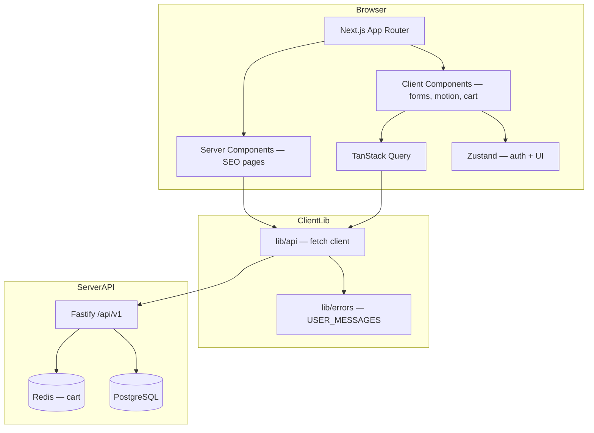
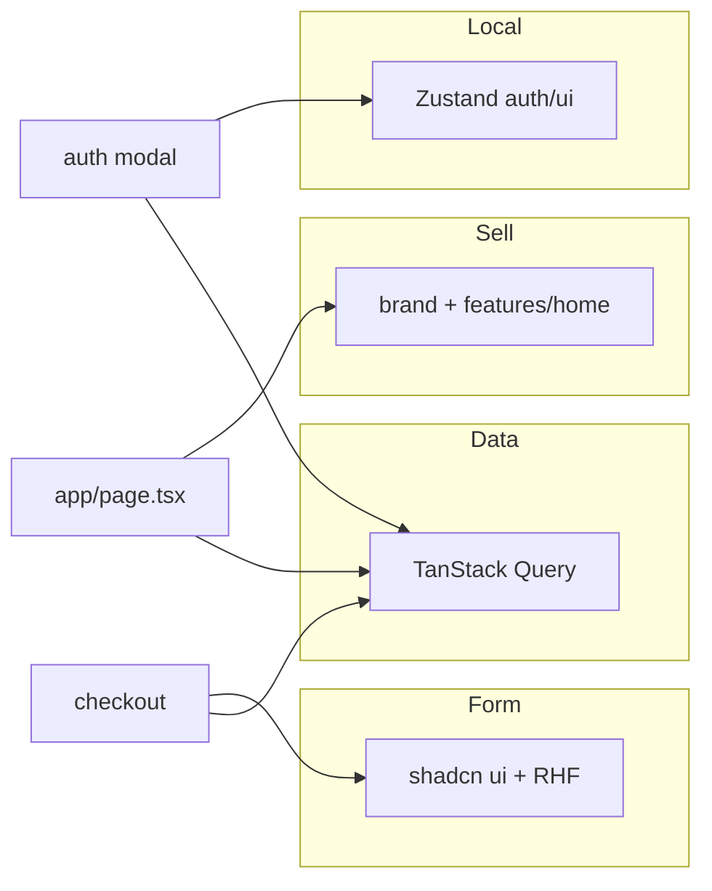
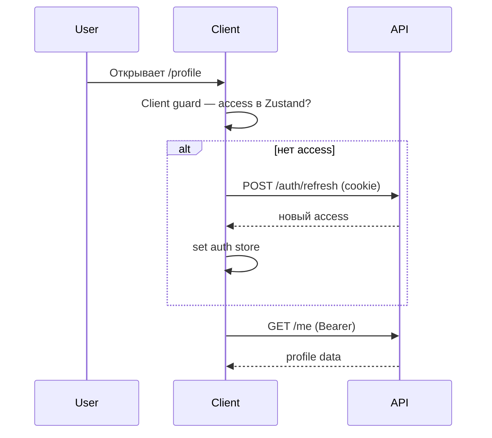
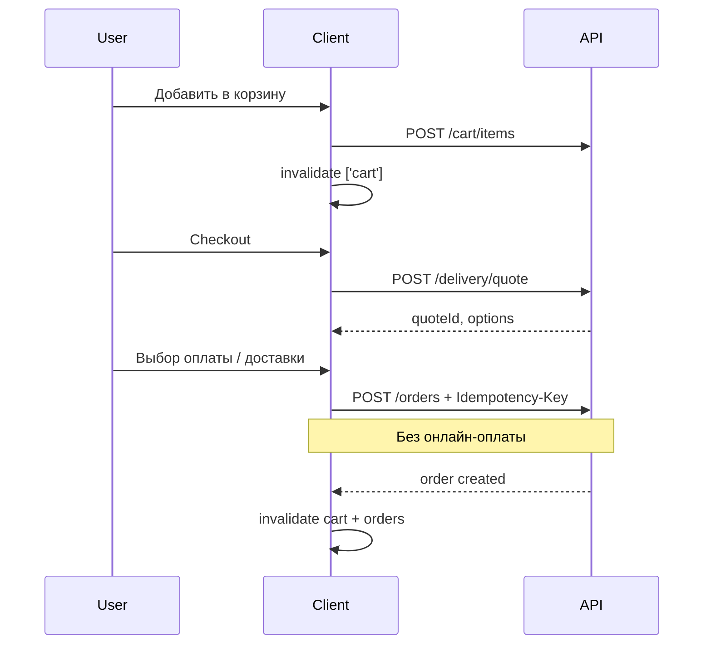

# MAZE — Архитектура фронтенда

> **Статус:** ✅ утверждено  
> **Клиент:** web-only (Next.js 15 browser)  
> **API:** Fastify · `/api/v1` · см. [API_CONTRACT.md](API_CONTRACT.md)  
> **Приоритеты:** SEO · скорость · фирменный UX · предсказуемая интеграция с API  
> **Версия:** 1.0 · июнь 2026  
> **Связанные документы:** [CLIENT_DECISIONS.md](CLIENT_DECISIONS.md) · [API_CONTRACT.md](API_CONTRACT.md) · [BACKEND_ARCHITECTURE.md](BACKEND_ARCHITECTURE.md)

---

## Содержание

1. [Цели](#цели)
2. [Общая схема](#общая-схема)
3. [Структура проекта](#структура-проекта)
4. [Слои и зоны ответственности](#слои-и-зоны-ответственности)
5. [Маршрутизация](#маршрутизация)
6. [Features](#features)
7. [Данные и состояние](#данные-и-состояние)
8. [API client](#api-client)
9. [SEO](#seo)
10. [Аутентификация и guards](#аутентификация-и-guards)
11. [Витрина и визуал](#витрина-и-визуал)
12. [Commerce flow](#commerce-flow)
13. [Staff: manager и admin](#staff-manager-и-admin)
14. [Рендеринг RSC vs Client](#рендеринг-rsc-vs-client)
15. [Деплой](#деплой)
16. [Решения до кода](#решения-до-кода)

---

## Цели

| Метрика | Цель (MVP) |
|---------|------------|
| LCP (PDP, каталог) | **< 2.5 s** (mobile) |
| SEO | Индексируемый HTML на витрине |
| TTI корзины / checkout | **< 3 s** после загрузки |
| Интеграция с API | 100% витрины и commerce на live API |
| UX | «Дорогой», но не шумный визуал по брифу |

---

## Общая схема



### Зеркало бэкенда

| Server | Client |
|--------|--------|
| `routes/` — тонкие хендлеры | `app/` — тонкие страницы |
| `services/` — бизнес-логика | `features/*` — сценарии, hooks, API |
| `lib/` | `lib/` — api, errors, utils |
| `plugins/` — cross-cutting | `middleware.ts`, `providers.tsx` |

---

## Структура проекта

```
Client/
├── app/
│   ├── layout.tsx
│   ├── providers.tsx
│   ├── globals.css                 # design tokens
│   ├── middleware.ts
│   ├── robots.ts
│   ├── sitemap.ts
│   ├── (storefront)/
│   │   ├── page.tsx                # /
│   │   ├── catalog/
│   │   ├── product/[slug]/
│   │   ├── cms/[slug]/
│   │   ├── contacts/
│   │   ├── reviews/
│   │   └── used/                   # redirect → Telegram
│   ├── (commerce)/
│   │   ├── cart/
│   │   └── checkout/
│   ├── (account)/
│   │   └── profile/...
│   └── (staff)/
│       ├── staff/login/
│       ├── manager/...
│       └── admin/...
│
├── components/
│   ├── ui/                         # shadcn
│   ├── brand/                      # Logo, типографика MAZE
│   ├── layout/                     # Header, Footer, Splash, Shell
│   ├── patterns/                   # ProductCard, Price — 2+ features
│   └── effects/                    # LiquidGradient, Scene3D — lazy
│
├── features/
│   ├── auth/
│   ├── home/
│   ├── content/
│   ├── catalog/
│   ├── cart/
│   ├── checkout/
│   ├── delivery/
│   ├── profile/
│   ├── reviews/
│   ├── manager/
│   └── admin/
│
├── lib/
│   ├── api/
│   │   ├── client.ts
│   │   ├── refresh.ts
│   │   └── errors.ts               # ApiError class
│   ├── errors/
│   │   └── user-messages.ts        # USER_MESSAGES by error.code
│   └── utils/
│       └── cn.ts
│
├── stores/
│   ├── auth.store.ts
│   └── ui.store.ts
│
├── types/
├── public/
│   └── brand/                      # SVG логотипа
│
├── next.config.ts
├── tailwind.config.ts
├── tsconfig.json
└── vitest.config.ts
```

### Шаблон feature-модуля

```
features/catalog/
├── api.ts           # getProducts(), getProductBySlug() → lib/api
├── keys.ts          # catalogKeys.products(filters)
├── hooks.ts         # useProducts(), useProduct(slug)
├── mutations.ts     # при необходимости
├── types.ts
└── components/      # CatalogFilters, ProductGallery — только catalog
```

**Query keys и hooks живут в домене**, не в одном глобальном файле.

---

## Слои и зоны ответственности



| Вопрос | Ответ |
|--------|-------|
| Данные с API? | TanStack Query |
| После мутации? | `invalidateQueries` / `refetch` |
| Access token? | Zustand |
| Модалки, splash? | Zustand ui |
| Продаёт? | brand / features |
| Форма? | shadcn + RHF |

---

## Маршрутизация

### Storefront `(storefront)/`

| URL | Рендер | API |
|-----|--------|-----|
| `/` | SSR/ISR | `GET /home`, catalog newest |
| `/catalog` | SSR/ISR | `GET /catalog/products` |
| `/catalog/[slug]` | SSR/ISR | категория / бренд |
| `/product/[slug]` | SSR/ISR | `GET /catalog/products/:slug` |
| `/cms/[slug]` | SSR/ISR | `GET /cms/:slug` |
| `/contacts` | SSR/ISR | settings + CMS |
| `/reviews` | SSR/ISR | `GET /reviews` |
| `/used` | redirect | Telegram URL из settings |

### Красивые URL → CMS (redirect 301)

| Публичный URL | Цель |
|---------------|------|
| `/about` | `/cms/about` |
| `/delivery` | `/cms/delivery` |
| `/warranty` | `/cms/warranty` |
| `/credit` | `/cms/credit` |
| `/repair` | `/cms/repair` |
| `/legal` | `/cms/legal` |

Реализация: `next.config.ts` redirects или тонкие `app/(storefront)/delivery/page.tsx` → redirect.

### Commerce `(commerce)/`

| URL | Рендер |
|-----|--------|
| `/cart` | Client |
| `/checkout` | Client |

### Account `(account)/`

| URL | Рендер |
|-----|--------|
| `/profile` | Client + guard |
| `/profile/orders` | Client |
| `/profile/orders/[id]` | Client |
| `/profile/favorites` | Client |
| `/profile/addresses` | Client |
| `/profile/companies` | Client |

### Staff `(staff)/`

| URL | Роль |
|-----|------|
| `/staff/login` | публичный |
| `/manager/orders` | manager+ |
| `/manager/orders/[id]` | manager+ |
| `/admin/...` | admin |

### Admin — вложенная структура

```
/admin
  /admin/catalog/categories
  /admin/catalog/products
  /admin/catalog/products/[id]
  /admin/catalog/products/[id]/variants
  /admin/content/banners
  /admin/content/slides
  /admin/content/cms
  /admin/content/partner-brands
  /admin/settings/editor-choice
  /admin/stock
```

---

## Features

| Feature | Ответственность |
|---------|----------------|
| **auth** | SMS OTP, refresh, staff login, session restore |
| **home** | главная, секции, композиция `GET /home` |
| **content** | CMS pages, `useCmsPage(slug)`, public settings, баннеры/slides как DTO |
| **catalog** | список, фильтры (цена, модель, память, цвет), PDP |
| **cart** | sync с Redis cart API |
| **delivery** | `POST /delivery/quote`, выбор СДЭК/Яндекс |
| **checkout** | оплата, доставка, `POST /orders` + Idempotency-Key |
| **profile** | `/me`, addresses, companies, consents, favorites |
| **reviews** | отзывы + карта (polish) |
| **manager** | заказы, статусы, заметки, assign |
| **admin** | CRUD каталога, контента, stock, uploads |

### content — scope

| Данные | Источник |
|--------|----------|
| CMS-страницы | `GET /cms/:slug` |
| Баннеры, slides, advantages, partner brands | `GET /home` |
| Публичные настройки (телефон, адрес, часы) | `GET /settings/public` |

`features/home` **композирует** секции; `features/content` **не дублирует** home-логику.

### manager vs admin

| | manager | admin |
|--|---------|-------|
| Задача | Операционка заказов | CRUD каталога и контента |
| API | `/manager/orders*` | `/admin/*` |
| UI | Таблица + карточка заказа | Вложенные разделы, тяжёлые формы |

---

## Данные и состояние

### Query keys (соглашение)

```typescript
// features/catalog/keys.ts
export const catalogKeys = {
  all: ['catalog'] as const,
  products: (f: CatalogFilters) => [...catalogKeys.all, 'products', f] as const,
  product: (slug: string) => [...catalogKeys.all, 'product', slug] as const,
  categories: () => [...catalogKeys.all, 'categories'] as const,
};

export const cartKeys = { root: ['cart'] as const };

export const meKeys = {
  root: ['me'] as const,
  orders: () => [...meKeys.root, 'orders'] as const,
};
```

### QueryClient defaults (ориентир)

| Query | staleTime |
|-------|-----------|
| catalog list | 60 s |
| product PDP | 60–120 s |
| cart | 0 (always fresh) |
| `/me` | 30 s |

---

## API client

```
lib/api/client.ts
```

```typescript
// Поведение (концепт)
async function api<T>(path: string, options?: ApiOptions): Promise<{ data: T; requestId: string }> {
  // credentials: 'include'
  // X-Requested-With: maze-web
  // Authorization: Bearer — из auth store при наличии
  // unwrap envelope { data, requestId }
  // throw ApiError на { error, requestId }
}
```

Features вызывают **только** `features/*/api.ts` → `lib/api`, не `fetch` напрямую.

Ошибки → `lib/errors/user-messages.ts` по `error.code`.

---

## SEO

### Стратегия по типам страниц

| Тип | Стратегия |
|-----|-----------|
| Главная, каталог, PDP, CMS, contacts | **SSR или ISR** + `generateMetadata` |
| Корзина, checkout, profile, staff | Client-only, `noindex` при необходимости |

### Обязательные файлы

| Файл | Назначение |
|------|------------|
| `app/sitemap.ts` | Динамический sitemap из API |
| `app/robots.ts` | Allow/disallow |
| `generateMetadata` на PDP | title, description, OG image |
| JSON-LD на PDP | Product + Offer |
| `/contacts` | LocalBusiness schema |

### TanStack Query и SEO

1. Server Component делает `fetch` → HTML с контентом.  
2. Client Component с Query — hydrate для интерактива (корзина, избранное).  
3. Опционально позже: `dehydrate` / `HydrationBoundary` для единого кэша.

**Правило:** бот должен видеть название, цену и описание товара **без выполнения client-only Query**.

---

## Аутентификация и guards



| Route | Guard |
|-------|-------|
| `/profile/*` | Client layout guard + refresh on mount |
| `/manager/*`, `/admin/*` | Middleware: staff cookie → иначе `/staff/login` |

Access JWT **не** в cookie → middleware **не** использует его для user routes.

---

## Витрина и визуал

### Главная (секции)

| Секция | Источник | Референс |
|--------|----------|----------|
| Splash | brand | iostrade |
| Hero + interactive bg | brand + effects (polish) | sweetpunk |
| Info carousel 5 с | `home.infoSlides` | iostrade |
| Advantages + trade-in | `home.advantages` | iostrade |
| Editor's choice 8–12 | admin → `home.editorChoice` | iostrade |
| Mixed grid | banners + products | mav.farm |
| New arrivals | catalog newest + bg carousel | mav.farm |
| Partner brands | `home.partnerBrands` | sweetpunk |
| Reviews + map | reviews API | бриф |

Секции: `features/home/components/`.

### PDP

- Галерея, варианты (цвет, память), цена, add to cart.
- Specs: аккордеон MVP; vertical carousel — polish (littleminx).
- **SSR HTML** для SEO; сдержанные анимации.

### Каталог

- Дерево: Apple → iPhone…, Samsung, Dyson, Gaming, Marshall, Harman Kardon, Sony.
- Фильтры: цена, модель, память, цвет.
- Яркие карточки, hover scale — умеренно.

---

## Commerce flow



### Оплата (отображение)

| Способ | UI |
|--------|-----|
| Наличные | Цена по ценнику |
| Карта / QR | +7% |
| Беспроцентная рассрочка | +5000 ₽ + комплект 3 аксессуаров (настраиваемый) |

Финальные суммы — с API при создании заказа.

### Доставка

| Сценарий | Правило (UI copy) |
|----------|-------------------|
| По городу СПб | от 500 ₽; курьер MAZE или Яндекс |
| Курьер MAZE | наличные возможны |
| Яндекс по городу | после 100% оплаты |
| По РФ (СДЭК/Яндекс) | 100% предоплата QR (+4%) |

---

## Staff: manager и admin

### Manager — карточка заказа

- Миниатюра товара, название, цена.
- ФИО, телефон клиента.
- Адрес доставки (город, район, улица, дом, подъезд, квартира).
- Статус, заметки, assign.

### Admin — товар

- Наименование, тип устройства, память, цвет.
- Фишки (название + описание + картинка), field array.
- Галерея фото.
- Stock toggle по вариантам.
- Specs по шаблону типа (смартфон / часы / планшет / MacBook / …).

---

## Рендеринг RSC vs Client

| Server Component | Client Component |
|------------------|------------------|
| `page.tsx` SEO routes | Header, cart drawer |
| `generateMetadata` | Framer Motion |
| initial catalog/product fetch | Forms, checkout |
| CMS content body | SMS modal |

**MVP path:** SSR на витрине с первого релиза; Query на клиенте для cart/favorites/interactions.

---

## Деплой

| Production | URL |
|------------|-----|
| Client | `https://maze.ru` |
| API | `https://api.maze.ru` |

```
NEXT_PUBLIC_API_URL=https://api.maze.ru/api/v1
NEXT_PUBLIC_SITE_URL=https://maze.ru
```

CORS и cookies — см. [IMPLEMENTATION_DECISIONS.md](IMPLEMENTATION_DECISIONS.md) §4.

---

## Решения до кода

Все инженерные развилки — в **[CLIENT_DECISIONS.md](CLIENT_DECISIONS.md)**.

Roadmap scaffold → production: CLIENT_DECISIONS §10.

---

*Следующий шаг: scaffold `Client/` (шаг 1 roadmap).*
