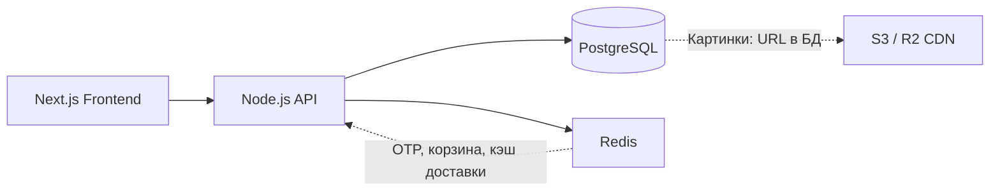
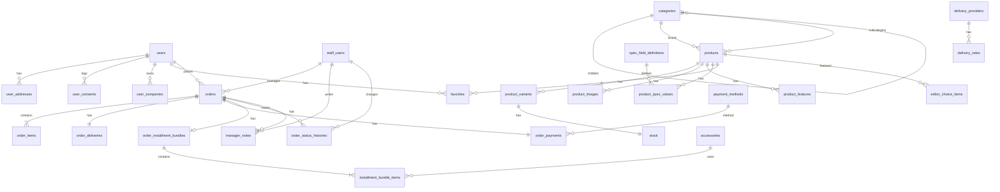
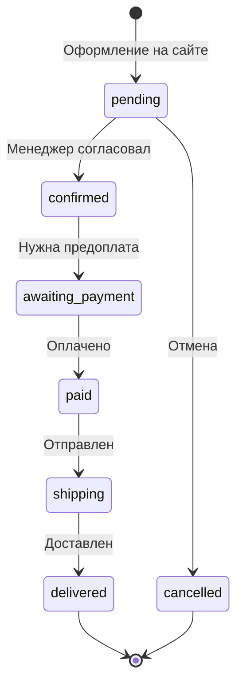
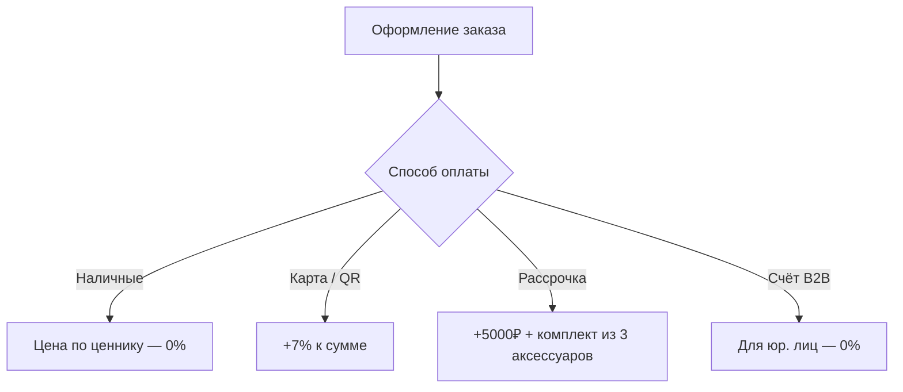
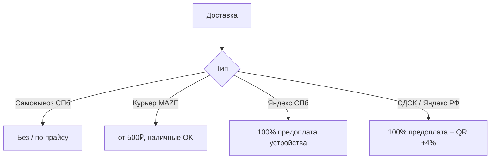
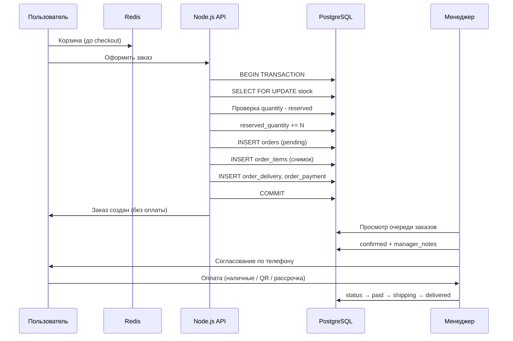

# MAZE — Архитектура базы данных

> **Статус:** ✅ утверждено  
> **Стек:** Node.js · Sequelize · PostgreSQL · Redis (кэш)  
> **Версия:** 1.2 · июнь 2026  
> **Связанные документы:** [Архитектура бэкенда](BACKEND_ARCHITECTURE.md) · [API Contract](API_CONTRACT.md)

---

## Содержание

1. [Принципы](#принципы)
2. [Слои системы](#слои-системы)
3. [Решения по развилкам](#решения-по-развилкам)
4. [Список таблиц (34)](#список-таблиц-34)
5. [ERD — связи](#erd--связи)
6. [Статусы заказа](#статусы-заказа)
7. [Оплата и доставка](#оплата-и-доставка)
8. [Поток оформления заказа](#поток-оформления-заказа)
9. [Спецификация таблиц](#спецификация-таблиц)
10. [Индексы](#индексы)
11. [Каскады и удаление](#каскады-и-удаление)
12. [Что вне PostgreSQL](#что-вне-postgresql)
13. [Sequelize — практики](#sequelize--практики)
14. [Что отложено (фаза 2)](#что-отложено-фаза-2)

---

## Принципы

| Принцип | Решение |
|---------|---------|
| Бренды | Дерево `categories`, корень = бренд (`is_brand`, `brand_logo_url`). Отдельная `brands` — только если позже понадобится отдельная SEO/партнёрская логика |
| Профиль | Одна таблица `users`, без `user_profiles` |
| Согласия | `user_consents` — история изменений; в `users` — текущие галочки |
| B2B | `user_companies` (пользователь сам добавляет компанию). `companies` + `company_members` — фаза 2 |
| Персонал | `staff_users` с `role: manager \| admin`, без отдельной таблицы `roles` |
| Характеристики | **Гибрид:** фильтры в `product_variants` + EAV (`spec_field_definitions` + `product_spec_values`) |
| Корзина | **Redis** (или фронт) до оформления — **не в PostgreSQL** |
| Заказы | Снимок цен в `order_items`; оплата после согласования с менеджером |
| Склад | `stock` на `product_variant`: `quantity` + `reserved_quantity` |
| Отзывы | Витринные `store_reviews` (Авито/Яндекс/2ГИС), не на каждый товар |
| MVP | Без Elasticsearch, read replica, CQRS |
| Клиент | **Web-only** (Next.js browser), без mobile app |
| Soft delete | A / B / C — см. [IMPLEMENTATION_DECISIONS.md](IMPLEMENTATION_DECISIONS.md) §16 |

### Утверждённые бизнес-правила (финал)

| # | Правило | Решение |
|---|---------|---------|
| 1 | **Резерв склада** | `reserved_quantity` увеличивается при создании заказа (`pending`). Фактическое списание `quantity` — при статусе **`paid`** |
| 2 | **Корзина** | Только **Redis** (ключ `cart:{sessionId\|userId}`) до checkout. В PostgreSQL корзины нет |
| 3 | **Согласия** | Текущее состояние — `users.subscribe_email` / `subscribe_sms`. Каждое изменение — запись в **`user_consents`** |

---

## Слои системы



| Уровень | Компонент | Задача |
|---------|-----------|--------|
| Презентация | Next.js | SSR, витрина, каталог, ЛК |
| API | Node.js + Express/Fastify | Бизнес-логика, расчёты, интеграции |
| Кэш | Redis | OTP, корзина до checkout, hot-кэш |
| Данные | PostgreSQL | Единственный источник правды |
| Файлы | S3/R2 | Фото товаров, баннеры, логотипы |

---

## Решения по развилкам

| # | Вопрос | Решение | Почему |
|---|--------|---------|--------|
| 1 | `categories` как дерево брендов | **Да** | Apple/Samsung — корень дерева. Поля `is_brand`, `brand_logo_url` |
| 2 | `user_consents` | **Да** | История согласий email/SMS — юридически чище, чем только галочки |
| 3 | B2B | **`user_companies`** | По ТЗ пользователь сам добавляет компанию в ЛК |
| 4 | `manager_notes` | **Да** | Комментарии менеджера при согласовании заказа |

---

## Список таблиц (36)

```
ПОЛЬЗОВАТЕЛИ (6)
  users
  sms_verifications
  user_addresses
  user_consents
  user_companies
  favorites

ПЕРСОНАЛ (3)
  staff_users
  staff_login_attempts
  manager_notes

КАТАЛОГ (8)
  categories
  products
  product_variants
  product_images
  product_features
  spec_field_definitions
  product_spec_values
  stock

СПРАВОЧНИКИ (3)
  payment_methods
  delivery_providers
  delivery_rates

ЗАКАЗЫ (8)
  orders
  order_items
  order_deliveries
  order_payments
  order_installment_bundles
  installment_bundle_items
  order_status_histories
  delivery_quotes

ИНФРАСТРУКТУРА (1)
  outbox_events

АКСЕССУАРЫ (1)
  accessories

КОНТЕНТ (6)
  editor_choice_items
  banners
  info_slides
  advantages
  partner_brands
  store_reviews
  cms_pages
  site_settings
```

### Иерархия категорий (из ТЗ)

```
Каталог
├── Apple → iPhone, Watch, iPad, MacBook, AirPods, Аксессуары
├── Samsung → Galaxy Phone, Galaxy Watch, Galaxy Buds
├── Dyson → Фены, Стайлеры, Выпрямители, Пылесосы, Очистители воздуха
├── Игровые приставки → PS5 Slim/Pro, Switch, Switch 2, SteamDeck, Аксессуары
├── Marshall → Наушники, Колонки
└── Harman Kardon → Наушники, Колонки
```

---

## ERD — связи



### Скелет связей (текст)

```
users ──< user_addresses
      ──< user_consents
      ──< user_companies
      ──< favorites >── products
      ──< orders ──< order_items >── products

categories (дерево, is_brand на корне) ──< products ──< product_variants ──|| stock
products ──< product_images
products ──< product_features
products ──< product_spec_values >── spec_field_definitions

orders ──< order_status_histories
orders ──< order_deliveries
orders ──< order_payments
orders ──< manager_notes
orders ──< order_installment_bundles ──< installment_bundle_items

delivery_providers ──< delivery_rates
staff_users ──< orders (assigned_manager_id)
```

---

## Статусы заказа



| Статус | Описание |
|--------|----------|
| `pending` | Создан на сайте, ждёт менеджера. **Без онлайн-оплаты** |
| `confirmed` | Менеджер согласовал состав и условия |
| `awaiting_payment` | Нужна предоплата (доставка РФ / Яндекс) |
| `paid` | Оплачено |
| `shipping` | Передан в доставку |
| `delivered` | Получен |
| `cancelled` | Отменён |

---

## Оплата и доставка

### Матрица оплаты



| Метод | Код | Наценка |
|-------|-----|---------|
| Наличные | `cash` | 0% |
| Карта / QR | `card_qr` | +7% |
| Рассрочка | `installment` | +5000₽ + 3 аксессуара |
| Счёт (B2B) | `invoice_b2b` | 0% |

**Комплект рассрочки по умолчанию:** стекло на выбор + чехол на выбор + блок зарядки 20W. Покупатель может заменить все 3.

### Матрица доставки



| Тип | Код | Правило |
|-----|-----|---------|
| Самовывоз | `pickup` | СПб, Чайковского 56 |
| Курьер MAZE | `spb_courier` | от 500₽, оплата наличными возможна |
| Яндекс (город) | `spb_yandex` | 100% предоплата устройства |
| СДЭК (РФ) | `rf_cdek` | 100% предоплата + QR +4% |
| Яндекс (РФ) | `rf_yandex` | 100% предоплата + QR +4% |

---

## Поток оформления заказа



### Резерв склада (в транзакции)

1. `SELECT FOR UPDATE` на `stock`
2. Проверка: `quantity - reserved_quantity >= нужное количество`
3. `reserved_quantity += N`
4. Создание `order` + `order_items` (снимок!)
5. `COMMIT` или `ROLLBACK`

**Списание резерва:** при статусе `paid` (рекомендация).

---

## Спецификация таблиц

### A. Пользователи

#### `users`

| Поле | Тип | Правила |
|------|-----|---------|
| `id` | UUID PK | |
| `phone` | VARCHAR(20) UNIQUE NOT NULL | главный идентификатор |
| `first_name` | VARCHAR(100) | |
| `last_name` | VARCHAR(100) | |
| `middle_name` | VARCHAR(100) | nullable |
| `gender` | ENUM `male`, `female` | nullable |
| `email` | VARCHAR(255) | nullable |
| `birth_date` | DATE | nullable |
| `subscribe_email` | BOOLEAN DEFAULT false | текущее состояние |
| `subscribe_sms` | BOOLEAN DEFAULT false | текущее состояние |
| `created_at` | TIMESTAMP | |
| `updated_at` | TIMESTAMP | |

#### `sms_verifications`

| Поле | Тип |
|------|-----|
| `id` | UUID PK |
| `phone` | VARCHAR(20) NOT NULL |
| `code_hash` | VARCHAR NOT NULL |
| `expires_at` | TIMESTAMP NOT NULL |
| `attempts` | INT DEFAULT 0 |
| `verified_at` | TIMESTAMP nullable |
| `created_at` | TIMESTAMP |

#### `user_addresses`

| Поле | Тип |
|------|-----|
| `id` | UUID PK |
| `user_id` | UUID FK → users |
| `type` | ENUM `home`, `work` |
| `city` | VARCHAR |
| `street` | VARCHAR |
| `house` | VARCHAR |
| `building` | VARCHAR nullable |
| `apartment` | VARCHAR nullable |
| `floor` | VARCHAR nullable |
| `is_default` | BOOLEAN DEFAULT false |

#### `user_consents`

| Поле | Тип |
|------|-----|
| `id` | UUID PK |
| `user_id` | UUID FK → users |
| `channel` | ENUM `email`, `sms` |
| `granted` | BOOLEAN |
| `ip_address` | VARCHAR nullable |
| `created_at` | TIMESTAMP |

#### `user_companies`

| Поле | Тип |
|------|-----|
| `id` | UUID PK |
| `user_id` | UUID FK → users |
| `name` | VARCHAR |
| `inn` | VARCHAR(12) |
| `kpp` | VARCHAR(9) nullable |
| `legal_address` | TEXT |

#### `favorites`

| Поле | Тип |
|------|-----|
| `user_id` | UUID FK → users |
| `product_id` | UUID FK → products |
| **PK** | `(user_id, product_id)` |

---

### B. Персонал

#### `staff_users`

| Поле | Тип |
|------|-----|
| `id` | UUID PK |
| `email` | VARCHAR UNIQUE NOT NULL |
| `password_hash` | VARCHAR NOT NULL |
| `role` | ENUM `manager`, `admin` |
| `first_name` | VARCHAR |
| `last_name` | VARCHAR |
| `is_active` | BOOLEAN DEFAULT true |

#### `manager_notes`

| Поле | Тип |
|------|-----|
| `id` | UUID PK |
| `order_id` | UUID FK → orders |
| `staff_user_id` | UUID FK → staff_users |
| `text` | TEXT NOT NULL |
| `created_at` | TIMESTAMP |

---

### C. Каталог

#### `categories`

| Поле | Тип |
|------|-----|
| `id` | UUID PK |
| `slug` | VARCHAR UNIQUE |
| `name` | VARCHAR |
| `parent_id` | UUID FK → categories nullable |
| `is_brand` | BOOLEAN DEFAULT false |
| `brand_logo_url` | VARCHAR nullable |
| `icon` | VARCHAR nullable |
| `image` | VARCHAR nullable |
| `description` | TEXT nullable |
| `sort_order` | INT DEFAULT 0 |
| `is_active` | BOOLEAN DEFAULT true |
| `external_link` | VARCHAR nullable |

#### `products`

| Поле | Тип |
|------|-----|
| `id` | UUID PK |
| `slug` | VARCHAR UNIQUE |
| `name` | VARCHAR |
| `category_id` | UUID FK → categories |
| `subcategory_id` | UUID FK → categories |
| `device_type` | ENUM `smartphone`, `watch`, `tablet`, `macbook`, `accessory`, `other` |
| `description` | TEXT nullable |
| `base_price` | DECIMAL(12,2) |
| `old_price` | DECIMAL(12,2) nullable |
| `badge_type` | ENUM `default`, `sale`, `new` nullable |
| `badge_text` | VARCHAR nullable |
| `is_published` | BOOLEAN DEFAULT false |
| `in_stock` | BOOLEAN DEFAULT true |
| `rating_avg` | DECIMAL(3,2) DEFAULT 0 |
| `reviews_count` | INT DEFAULT 0 |

#### `product_variants`

| Поле | Тип |
|------|-----|
| `id` | UUID PK |
| `product_id` | UUID FK → products |
| `sku` | VARCHAR UNIQUE |
| `color_name` | VARCHAR |
| `color_hex` | VARCHAR(7) |
| `memory` | VARCHAR nullable |
| `price` | DECIMAL(12,2) |
| `is_available` | BOOLEAN DEFAULT true |

#### `stock` (1:1 с variant)

| Поле | Тип |
|------|-----|
| `variant_id` | UUID PK FK → product_variants |
| `quantity` | INT DEFAULT 0 |
| `reserved_quantity` | INT DEFAULT 0 |

#### `product_images`

| Поле | Тип |
|------|-----|
| `id` | UUID PK |
| `product_id` | UUID FK |
| `url` | VARCHAR |
| `sort_order` | INT |
| `is_primary` | BOOLEAN |

#### `product_features`

| Поле | Тип |
|------|-----|
| `id` | UUID PK |
| `product_id` | UUID FK |
| `title` | VARCHAR |
| `description` | TEXT |
| `icon_url` | VARCHAR nullable |
| `sort_order` | INT |

#### `spec_field_definitions`

| Поле | Тип |
|------|-----|
| `id` | UUID PK |
| `device_type` | ENUM |
| `group_name` | VARCHAR |
| `field_key` | VARCHAR |
| `field_label` | VARCHAR |
| `sort_order` | INT |

#### `product_spec_values`

| Поле | Тип |
|------|-----|
| `product_id` | UUID FK |
| `field_id` | UUID FK → spec_field_definitions |
| `value` | TEXT |
| **UNIQUE** | `(product_id, field_id)` |

---

### D. Справочники

#### `payment_methods`

| Поле | Тип |
|------|-----|
| `id` | UUID PK |
| `code` | VARCHAR UNIQUE |
| `name` | VARCHAR |
| `fee_percent` | DECIMAL(5,2) DEFAULT 0 |
| `fee_fixed` | DECIMAL(12,2) DEFAULT 0 |
| `is_active` | BOOLEAN |

**Seed:**

| code | name | fee_percent | fee_fixed |
|------|------|-------------|-----------|
| `cash` | Наличные | 0 | 0 |
| `card_qr` | Карта / QR | 7 | 0 |
| `installment` | Рассрочка | 0 | 5000 |
| `invoice_b2b` | Счёт (юр. лицо) | 0 | 0 |

#### `delivery_providers`

| code | name |
|------|------|
| `maze_courier` | Курьер MAZE |
| `yandex` | Яндекс Доставка |
| `cdek` | СДЭК |

#### `delivery_rates`

| Поле | Тип |
|------|-----|
| `id` | UUID PK |
| `provider_id` | UUID FK |
| `delivery_type` | ENUM |
| `city_scope` | VARCHAR |
| `base_price` | DECIMAL(12,2) |
| `requires_prepay` | BOOLEAN |
| `fee_percent` | DECIMAL(5,2) |

---

### E. Заказы

#### `orders`

| Поле | Тип |
|------|-----|
| `id` | UUID PK |
| `order_number` | VARCHAR UNIQUE |
| `user_id` | UUID FK nullable |
| `assigned_manager_id` | UUID FK → staff_users nullable |
| `customer_first_name` | VARCHAR |
| `customer_last_name` | VARCHAR |
| `customer_phone` | VARCHAR NOT NULL |
| `customer_email` | VARCHAR nullable |
| `status` | ENUM |
| `subtotal` | DECIMAL(12,2) |
| `delivery_price` | DECIMAL(12,2) |
| `payment_fee` | DECIMAL(12,2) |
| `installment_fee` | DECIMAL(12,2) |
| `total` | DECIMAL(12,2) |
| `comment` | TEXT nullable |
| `idempotency_key` | VARCHAR UNIQUE nullable |
| `pricing_version` | VARCHAR NOT NULL |
| `created_at` | TIMESTAMP |

#### `order_items` (снимок — immutable)

| Поле | Тип |
|------|-----|
| `id` | UUID PK |
| `order_id` | UUID FK |
| `product_id` | UUID FK |
| `variant_id` | UUID FK nullable |
| `name` | VARCHAR |
| `image` | VARCHAR |
| `color` | VARCHAR nullable |
| `memory` | VARCHAR nullable |
| `unit_price` | DECIMAL(12,2) |
| `quantity` | INT |

#### `order_deliveries`

| Поле | Тип |
|------|-----|
| `order_id` | UUID PK FK |
| `type` | ENUM |
| `city` | VARCHAR |
| `district` | VARCHAR nullable |
| `street` | VARCHAR |
| `house` | VARCHAR |
| `entrance` | VARCHAR nullable |
| `apartment` | VARCHAR nullable |
| `requires_prepay` | BOOLEAN |
| `tracking_number` | VARCHAR nullable |

#### `order_payments`

| Поле | Тип |
|------|-----|
| `order_id` | UUID PK FK |
| `payment_method_id` | UUID FK |
| `fee_percent` | DECIMAL(5,2) |
| `fee_amount` | DECIMAL(12,2) |
| `is_paid` | BOOLEAN DEFAULT false |
| `paid_at` | TIMESTAMP nullable |
| `paid_amount` | DECIMAL(12,2) nullable |

#### `order_installment_bundles` + `installment_bundle_items`

Рассрочка: `fee_amount` = 5000₽, 3 аксессуара из справочника `accessories`.

#### `order_status_histories`

| Поле | Тип |
|------|-----|
| `id` | UUID PK |
| `order_id` | UUID FK |
| `from_status` | ENUM nullable |
| `to_status` | ENUM |
| `staff_user_id` | UUID FK nullable |
| `note` | TEXT nullable |
| `created_at` | TIMESTAMP |

#### `delivery_quotes` (кэш, не часть заказа)

| Поле | Тип |
|------|-----|
| `id` | UUID PK |
| `provider` | VARCHAR |
| `payload` | JSONB |
| `price` | DECIMAL(12,2) |
| `expires_at` | TIMESTAMP |

| `expires_at` | TIMESTAMP |

#### `outbox_events` (transactional outbox)

| Поле | Тип |
|------|-----|
| `id` | UUID PK |
| `event_type` | VARCHAR (`order.created`, `order.paid`, …) |
| `aggregate_type` | VARCHAR (`order`, …) |
| `aggregate_id` | UUID |
| `payload` | JSONB |
| `status` | ENUM `pending`, `processing`, `done`, `failed` |
| `created_at` | TIMESTAMP |
| `processed_at` | TIMESTAMP nullable |

Worker: `SELECT ... FOR UPDATE SKIP LOCKED WHERE status = 'pending'`.

---

### F. Персонал — аудит

#### `staff_login_attempts`

| Поле | Тип |
|------|-----|
| `id` | UUID PK |
| `staff_user_id` | UUID FK nullable |
| `email` | VARCHAR |
| `ip` | VARCHAR |
| `user_agent` | TEXT nullable |
| `success` | BOOLEAN |
| `created_at` | TIMESTAMP |

---

### G. Аксессуары

#### `accessories`

| Поле | Тип |
|------|-----|
| `id` | UUID PK |
| `name` | VARCHAR |
| `category` | ENUM `glass`, `case`, `charger`, `other` |
| `price` | DECIMAL(12,2) |
| `image` | VARCHAR nullable |
| `is_active` | BOOLEAN |

---

### H. Контент

| Таблица | Назначение |
|---------|------------|
| `editor_choice_items` | 8–12 товаров на главной (`product_id`, `sort_order`) |
| `banners` | Рекламные блоки (`size`: large/small) |
| `info_slides` | Карусель «важная информация» (каждые 5 сек) |
| `advantages` | Доставка, трейд-ин, гарантия |
| `partner_brands` | Логотипы партнёров |
| `store_reviews` | Отзывы Авито/Яндекс/2ГИС у карты |
| `cms_pages` | О нас, Доставка, Гарантия, Кредит, Ремонт, Юр.лица |
| `site_settings` | Контакты, соцсети, наценки, координаты карты (key-value) |

---

## Индексы

| Область | Индекс |
|---------|--------|
| Пользователь | `UNIQUE users(phone)` |
| OTP | `(sms_verifications.phone, expires_at)` |
| Каталог | `products(category_id, subcategory_id) WHERE is_published` |
| Фильтры | `product_variants(memory, color_name, price)` |
| Цена | `products(base_price)` |
| Поиск | `GIN pg_trgm ON products(name)` |
| Заказы менеджера | `orders(status, created_at DESC)` |
| Заказы менеджера | `orders(assigned_manager_id, status)` |
| ЛК пользователя | `orders(user_id, created_at DESC)` |
| Идемпотентность | `UNIQUE orders(idempotency_key) WHERE idempotency_key IS NOT NULL` |
| Outbox | `outbox_events(status, created_at) WHERE status = 'pending'` |
| Staff audit | `staff_login_attempts(email, created_at DESC)` |
| Избранное | `UNIQUE favorites(user_id, product_id)` |
| Slug | `UNIQUE products(slug)`, `UNIQUE categories(slug)` |
| SKU | `UNIQUE product_variants(sku)` |

---

## Каскады и удаление

Полная политика A/B/C: **[IMPLEMENTATION_DECISIONS.md §16](IMPLEMENTATION_DECISIONS.md#16-soft-delete-policy-a--b--c)**.

| Сущность | Правило |
|----------|---------|
| `products` | Soft delete (`deleted_at`) или `is_published = false` |
| `orders` | **Никогда не удалять** — только `cancelled` |
| `order_items` | Привязаны к order навсегда |
| `users` | Soft delete; заказы сохраняются |
| `categories` | Запрет удаления если есть `products` |
| `stock` | CASCADE при удалении variant (variant не удалять при наличии заказов) |

---

## Что вне PostgreSQL

| Данные | Где хранить |
|--------|-------------|
| Корзина до оформления | Redis |
| OTP-сессия | Redis + `sms_verifications` |
| Кэш расчёта доставки | `delivery_quotes` + Redis |
| Изображения | S3/R2, в БД только URL |
| Поиск (фаза 2) | Elasticsearch — только при реальной нагрузке |

---

## Sequelize — практики

```javascript
// Глобальные настройки моделей
define: {
  underscored: true,    // snake_case в PostgreSQL
  timestamps: true,     // created_at, updated_at
}
```

### Основные ассоциации

```javascript
Category.hasMany(Category, { as: 'children', foreignKey: 'parent_id' });
Category.belongsTo(Category, { as: 'parent', foreignKey: 'parent_id' });

Product.belongsTo(Category, { as: 'brand', foreignKey: 'category_id' });
Product.belongsTo(Category, { as: 'subcategory', foreignKey: 'subcategory_id' });
Product.hasMany(ProductVariant, { as: 'variants' });
Product.hasMany(ProductImage, { as: 'images' });
Product.hasMany(ProductFeature, { as: 'features' });

ProductVariant.hasOne(Stock, { as: 'stock' });

User.hasMany(Order, { as: 'orders' });
User.belongsToMany(Product, { through: Favorite, as: 'favorites' });

Order.belongsTo(StaffUser, { as: 'manager', foreignKey: 'assigned_manager_id' });
Order.hasMany(OrderItem, { as: 'items' });
Order.hasOne(OrderDelivery, { as: 'delivery' });
Order.hasOne(OrderPayment, { as: 'payment' });
Order.hasMany(ManagerNote, { as: 'notes' });
Order.hasMany(OrderStatusHistory, { as: 'statusHistory' });
```

### Транзакция создания заказа

Всё в `sequelize.transaction()`:
1. Блокировка `stock`
2. Резерв
3. `orders` + `order_items` + `order_deliveries` + `order_payments`
4. `order_status_histories` (→ pending)
5. Commit или Rollback

---

## Что отложено (фаза 2)

- `audit_logs` — полный аудит админских действий
- `companies` + `company_members` — совместный B2B-доступ
- Отдельная таблица `brands`
- Elasticsearch для поиска
- Read replica PostgreSQL
- CQRS

---

## Маппинг с текущими JSON-файлами (фронт)

| `src/data/*.json` | Таблицы |
|-------------------|---------|
| `categories.json` | `categories` |
| `products.json` | `products`, `product_variants`, `product_spec_values`, `stock` |
| `orders.json` | `orders`, `order_items` |
| `users.json` | `users`, `user_addresses`, `user_companies` |
| `editor-choice.json` | `editor_choice_items` |
| `site-config.json` | `site_settings` |
| `banners.json` | `banners` |
| `reviews.json` | `store_reviews` |

---

## Следующие шаги (когда начнём код)

1. Scaffold `backend/` — Sequelize + миграции
2. Seeders из `src/data/*.json`
3. API-эндпоинты для фронта
4. Интеграции СДЭК / Яндекс / SMS

---

*Документ создан по результатам согласования архитектуры между вариантами проектирования. Второй вариант (Elasticsearch, CQRS, реплики) отклонён для MVP.*
