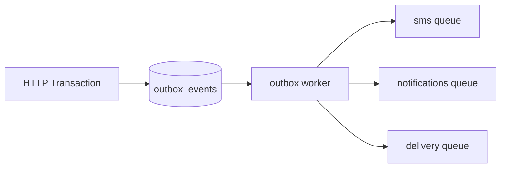

# MAZE — Решения до кода

> **Статус:** ✅ инженерные правила (финал, неизменяемые перед реализацией)  
> **Версия:** 2.0 · июнь 2026  
> **Связанные документы:** [BACKEND_ARCHITECTURE.md](BACKEND_ARCHITECTURE.md) · [API_CONTRACT.md](API_CONTRACT.md) · [DATABASE_ARCHITECTURE.md](DATABASE_ARCHITECTURE.md)

Чеклист закрывает развилки, которые **нельзя решать в процессе scaffold**.

---

## 1. Технологический стек

| Параметр | Решение |
|----------|---------|
| Язык | **TypeScript** |
| Module system | **ESM** (`"type": "module"`) |
| Node.js | **>= 20** |
| HTTP framework | **Fastify 4+** (обязательно, Express не используем) |
| ORM | Sequelize 6+ |
| Валидация | Zod |
| Очереди | BullMQ |
| Тесты | Vitest |
| Линтер | ESLint + typescript-eslint |

```
backend/ — TypeScript · ESM · Fastify · Node >= 20
```

---

## 2. Формат API-ответов

### Успех

```json
{ "data": {}, "requestId": "req_..." }
```

| Правило | Решение |
|---------|---------|
| `data` | **Всегда** в успешном ответе. Void-операции → `{ "ok": true }` |
| `meta` | **Только** у paginated list: `{ page, limit, total }` |
| `requestId` | **Всегда** в успехе и ошибке |

### Ошибка

```json
{
  "error": { "code": "VALIDATION_ERROR", "message": "...", "details": [] },
  "requestId": "req_..."
}
```

| Правило | Решение |
|---------|---------|
| `error.details` | **Всегда массив** (пустой `[]`, если нет полей) |
| UX на фронте | Только по **`error.code`**, не по HTTP-статусу |

### requestId / correlationId

**Формула (единственная, без вариантов):**

```
requestId = валидный X-Request-Id из запроса  ИЛИ  новый uuid, сгенерированный сервером
correlationId = requestId
```

Если клиент **не** прислал `X-Request-Id` (или он невалиден) — сервер **создаёт новый** `requestId`. Именно **он** становится `correlationId` для outbox и BullMQ jobs, порождённых этим HTTP-запросом.

| Этап | Поле |
|------|------|
| HTTP ответ | `requestId` |
| Pino / AsyncLocalStorage | `requestId` |
| `outbox_events.payload` | `correlationId` (= `requestId`) |
| BullMQ job `data` | `correlationId` (= `requestId` источника) |

`X-Request-Id`: принимается, если uuid/nanoid, max 64 символа.

Outbox worker, обрабатывающий событие **без** HTTP-контекста, **наследует** `correlationId` из payload события (не генерирует новый).

---

## 3. AppError и mapping в HTTP

Базовый класс `AppError`:

```typescript
class AppError extends Error {
  code: string;
  statusCode: number;   // единственное поле HTTP-маппинга
  details: Array<{ field?: string; message: string }>;
  isOperational: boolean; // true = ожидаемая ошибка
}
```

`errorHandler` читает **только** `statusCode` → HTTP-статус ответа. Других имён (`httpStatus`, `status`) в коде не используем.

| Класс | `code` (пример) | `statusCode` |
|-------|-----------------|--------------|
| `ValidationError` | `VALIDATION_ERROR` | 400 |
| `UnauthorizedError` | `UNAUTHORIZED` / `TOKEN_EXPIRED` | 401 |
| `ForbiddenError` | `FORBIDDEN` / `CSRF_VALIDATION_FAILED` | 403 |
| `NotFoundError` | `NOT_FOUND` | 404 |
| `ConflictError` | `ORDER_OUT_OF_STOCK`, `QUOTE_EXPIRED`, … | 409 |
| `RateLimitError` | `RATE_LIMIT_EXCEEDED` | 429 |

**Правила:**
- Неизвестные ошибки → `500 INTERNAL_ERROR`, без stack в ответе
- `ConflictError` всегда с явным `code` (см. API_CONTRACT)
- Fastify `errorHandler` — единственное место маппинга в JSON

### UX: принцип отображения ошибок

**UI ориентируется на `error.code`, не на HTTP-статус и не слепо на `error.message`.**

```typescript
// Фронт: словарь дефолтных текстов по code (можно переопределить)
const USER_MESSAGES: Record<string, string> = {
  ORDER_OUT_OF_STOCK: 'Товар закончился. Обновите корзину.',
  QUOTE_EXPIRED: 'Срок расчёта доставки истёк. Пересчитайте доставку.',
  // ...
};

function getUserMessage(error: ApiError): string {
  return USER_MESSAGES[error.code]
    ?? error.message   // для VALIDATION_ERROR и др. — можно взять с сервера
    ?? 'Что-то пошло не так. Попробуйте позже.';
}
```

| Принцип | Решение |
|---------|---------|
| Источник truth для UX | **`error.code`** |
| Текст | Дефолт на фронте по `code`; `error.message` — опциональное переопределение с сервера |
| `VALIDATION_ERROR` | Можно показывать `message` / `details[].message` |
| `INTERNAL_ERROR`, `FORBIDDEN`, `NOT_FOUND` (generic) | Только дефолтный текст, без деталей сервера |
| `error.message` с API | Не обязателен для UI; сервер может отдавать технический или user-friendly текст |

Жёсткая привязка «код → всегда показывать message» в документации **не фиксируется** — только принцип выше.

---

## 4. Cookie-policy

### Production

```
https://maze.ru       → Next.js
https://api.maze.ru    → Fastify API
```

| Cookie | Domain | Path | SameSite | Secure |
|--------|--------|------|----------|--------|
| `maze_guest` | `.maze.ru` | `/` | Lax | true |
| `maze_refresh` | `.maze.ru` | `/api/v1/auth` | Strict | true |
| `maze_staff_refresh` | `.maze.ru` | `/api/v1/auth/staff` | Strict | true |
| `maze_csrf` | — | — | — | **Фаза 2** |

### Development

| Cookie | Domain | Примечание |
|--------|--------|------------|
| Все | **не задавать** (host-only) | `localhost:3000` + `localhost:4000` |

```
CORS Origin: http://localhost:3000
credentials: true
```

### Refresh / logout (фронт)

```
401 TOKEN_EXPIRED:
  1. POST /auth/refresh (credentials: include)
  2. сохранить access в memory store
  3. retry исходный запрос 1 раз
  4. снова 401 → logout UI

logout:
  POST /auth/logout (credentials: include)
  clear access store → redirect /
```

### CSRF (фаза 1)

Только `X-Requested-With: maze-web` на POST/PATCH/DELETE. Cookie `maze_csrf` — **не в MVP**.

---

## 5. Outbox и BullMQ — граница ответственности



| Компонент | Роль |
|-----------|------|
| **`outbox_events`** | Source of truth: что произошло в бизнесе, атомарно с транзакцией |
| **BullMQ** | Исполнитель: доставить side-effect (SMS, notify, внешний API) |
| **Правило** | Не enqueue в BullMQ напрямую из HTTP, если событие должно пережить сбой после commit |

**Поток:**
1. В транзакции: `INSERT outbox_events (pending)`
2. Outbox worker: `FOR UPDATE SKIP LOCKED` → dispatch в нужную очередь → `status = done`
3. BullMQ worker: выполняет задачу, retry по политике очереди

**Не дублировать:** одно бизнес-событие = одна строка outbox. BullMQ job — производное действие.

---

## 6. Бизнес-события (outbox)

Именование: `domain.action`, lowercase, past tense.

| event_type | aggregate | Когда | BullMQ action |
|------------|-----------|-------|---------------|
| `order.created` | `order` | Commit заказа | → `notifications` |
| `order.paid` | `order` | status → paid | → `notifications` (опц.) |
| `order.cancelled` | `order` | status → cancelled | лог / release (если вне TX) |
| `user.sms_verified` | `user` | Успешный `sms/verify` (upsert по phone) | лог (не «registered») |
| `staff.login_failed` | `staff_user` | Неудачный staff login | → audit `staff_login_attempts` |

**Не в outbox:**
- `cart.merged` — синхронно при verify
- `delivery.quote_requested` — напрямую в `delivery` queue (не бизнес-fact после commit)

> **Важно:** `user.sms_verified`, не `user.registered` — у нас upsert по телефону, не классическая регистрация.

---

## 7. Workers — приоритет запуска

| # | Очередь | Запуск |
|---|---------|--------|
| 1 | `outbox` | сразу (poll) |
| 2 | `sms` | сразу |
| 3 | `stock` | cron 15 мин |
| 4 | `notifications` | сразу |
| 5 | `delivery` | сразу |

Retry/backoff — **только** из `config/retry.ts` (§15). Очереди не задают свои числа.

---

## 8. Retry внешних API

См. `RETRY.http.*` в §15. Fallback:

| Провайдер | При исчерпании retry |
|-----------|----------------------|
| SMS | лог + alert; пользователь видит anti-enumeration «код отправлен» |
| СДЭК / Яндекс | `QUOTE_INVALID` или «уточним при звонке» |
| S3/R2 | `500` admin upload |

---

## 9. Транзакции и блокировки

| Правило | Решение |
|---------|---------|
| Sequelize | **Только** `sequelize.transaction(async (t) => { ... })` |
| Ручной commit/rollback | **Запрещён** |
| `sync` / `alter` | **`sync: false` всегда**, autoSync нигде |
| Stock lock | `SELECT ... FOR UPDATE` обязателен |
| Порядок lock | `variant_id ASC` — детерминированный порядок |
| Deadlock | Retry до **3** раз: 10ms → 50ms → 150ms (`40P01`) |
| Timeout заказа | **5 сек** на транзакцию |
| Идемпотентность | Проверка Redis **до** транзакции; UNIQUE в БД — страховка |

---

## 10. Миграции и индексы

| Тема | Решение |
|------|---------|
| Миграции | **Вручную**, не auto-generate в prod |
| Индексы | В той же миграции, что таблица |
| Partial indexes | По спеке DATABASE_ARCHITECTURE (`WHERE is_published`, `status = pending`) |
| FK | `fk_<table>_<column>_<ref>` |
| UNIQUE | `uq_<table>_<columns>` |
| PR checklist | миграция + индексы из спеки |

---

## 11. Seed-данные

| Окружение | Источник | Что сидим |
|-----------|----------|-----------|
| **dev / staging** | `src/data/*.json` | categories, products, banners, CMS, settings, payment/delivery справочники |
| **production** | **Только** справочники и site_settings | payment_methods, delivery_providers, delivery_rates, site_settings |
| **production** | **Не сидим** | demo-товары, demo-заказы, demo-users |

Команда: `npm run db:seed` (dev), `npm run db:seed:prod-bootstrap` (только справочники).

---

## 12. Cache invalidation (admin)

**Fail-safe правило для всех admin mutate (обязательно одинаково):**

```
1. Бизнес-операция в PostgreSQL → успех
2. cache.invalidate(keys) в try/catch
3. DEL fail → logger.warn({ event: 'cache_invalidation_failed', keys, requestId })
4. reply 200 с data (успех операции не отменяется)
5. MVP: повтор вручную или дождаться TTL
6. Фаза 2: enqueue cache.invalidate job
```

| Правило | Решение |
|---------|---------|
| MVP | Синхронный `DEL` Redis после admin mutate |
| Ошибка DEL | **Никогда** не превращать в `500`, если PG save успешен |
| Ошибка DEL | `warn` log + метрика/alert `cache_invalidation_failed` |

---

## 13. Логирование (pino)

См. также §17 Observability.

**Маскировать:** `phone`, `password`, `code`, `authorization`, `cookie`, `refreshToken`.

**Slow request:** warn если > 500ms.

---

## 14. Error-handler (единственная точка форматирования)

### Принцип: throw everywhere, format once

```
Route → Controller → Service
         ↓ throw AppError | ZodError | unknown
plugins/error-handler.ts  ← setErrorHandler, ЕДИНСТВЕННОЕ место JSON-ответа
```

**Запрещено:**
- `try/catch` в контроллерах с `reply.send({ error })`
- Отдельные error-middleware на роуты
- Ручной `reply.code(4xx)` для Zod / AppError

**Допустимо в контроллере:** только `throw`.

### Маппинг в handler

| Источник | Результат |
|----------|-----------|
| `ZodError` | `ValidationError`, `VALIDATION_ERROR`, `statusCode: 400`, `details` из `issue.path` |
| `AppError` (`isOperational: true`) | JSON как есть |
| `SequelizeUniqueConstraintError` | `ConflictError`, `DUPLICATE_RESOURCE` |
| `SequelizeForeignKeyConstraintError` | `ValidationError` или `ConflictError` |
| Всё остальное | `500 INTERNAL_ERROR`, generic message, без stack в ответе |

### Логирование в handler

| Тип | Уровень | Sentry |
|-----|---------|--------|
| `AppError`, operational | `warn` (4xx) | нет |
| `ZodError` | `info` / `warn` | нет |
| `500`, unhandled | `error` + stack | **да** |

В лог: `requestId`, `code`, `statusCode`, `route`, `method`, `userId?`, `staffId?`.

### Zod

| Слой | Роль |
|------|------|
| `validators/*.ts` | Zod-схемы |
| Route `preValidation` / controller | `schema.parse()` → throw |
| Service | только бизнес-валидация, не HTTP-shape |

---

## 15. Retry / backoff (`config/retry.ts`)

**Единственный источник чисел.** Очереди и HTTP-клиенты импортируют отсюда.

```typescript
export const RETRY = {
  bullmq: {
    sms:           { attempts: 3, backoff: { type: 'fixed', delay: [5000, 30000] } },
    delivery:      { attempts: 3, backoff: { type: 'exponential', delay: 5000 } },
    notifications: { attempts: 3, backoff: { type: 'exponential', delay: 10000 } },
    outbox:        { attempts: 1 },  // poll worker, не retry dispatch
    stock:         { attempts: 1 },  // cron
  },
  transaction: {
    deadlock: { maxAttempts: 3, delaysMs: [10, 50, 150] },
    timeoutMs: 5000,
  },
  http: {
    sms:    { attempts: 2, timeoutMs: 5000,  delaysMs: [5000, 30000] },
    cdek:   { attempts: 3, timeoutMs: 8000,  delaysMs: [5000, 15000, 45000] },
    yandex: { attempts: 3, timeoutMs: 8000,  delaysMs: [5000, 15000, 45000] },
    s3:     { attempts: 2, timeoutMs: 30000, delaysMs: [2000, 10000] },
  },
} as const;
```

| Слой | Правило |
|------|---------|
| BullMQ | Только `RETRY.bullmq.*` |
| HTTP | Обёртка `withRetry(RETRY.http.*, fn)` |
| Deadlock | `runInTransactionWithRetry()` — только `40P01` / Sequelize deadlock |
| Outbox fail | `status = failed` + alert; не бесконечный retry |

---

## 16. Soft delete policy (A / B / C)

| Категория | Sequelize | Правило |
|-----------|-----------|---------|
| **A. Paranoid** | `paranoid: true` | Soft delete; данные остаются |
| **B. Immutable** | delete **запрещён** | Только INSERT / UPDATE статуса |
| **C. Ephemeral** | hard delete OK | Временные / технические данные |

### Таблицы

| Таблица | Кат. | Примечание |
|---------|------|------------|
| `users`, `user_addresses`, `user_companies` | A | |
| `products`, `product_variants`, `categories` | A | + `is_published: false` |
| `staff_users` | A | деактивация |
| `payment_methods`, `delivery_*`, `accessories` | A | или `is_active: false` |
| Контент (banners, cms, slides, …) | A | |
| `spec_field_definitions` | A | |
| `orders`, `order_items`, `order_deliveries`, `order_payments` | B | только `cancelled` |
| `order_installment_bundles`, `installment_bundle_items` | B | |
| `order_status_histories`, `manager_notes` | B | append-only |
| `user_consents` | B | юридический аудит, **никогда delete** |
| `site_settings` | B | только UPDATE |
| `favorites`, `stock` | C | hard delete |
| `product_images`, `product_features`, `product_spec_values` | C | replace / cascade |
| `editor_choice_items` | C | replace при PUT |
| `sms_verifications`, `delivery_quotes` | C | purge по TTL |
| `outbox_events` | C | purge `done` старше N дней |
| `staff_login_attempts` | C | purge старше 90 дней |

### Restore (MVP, admin only)

| Да | Нет |
|----|-----|
| `products`, `variants`, `categories` | `orders`, `user_consents` |
| `users`, `staff_users` | остальное |

`paranoid: false` в запросах — **только** admin-service, не public API.

---

## 17. Observability

### Обязательные поля лога

`timestamp`, `level`, `requestId`, `correlationId?`, `msg`, `route`, `method`, `statusCode`, `durationMs`, `userId?`, `staffId?`

### Sentry (MVP)

| Отправлять | Не отправлять |
|------------|---------------|
| `500`, unhandled exceptions | Все operational `4xx` |
| Redis / PG connection down | `VALIDATION_ERROR`, rate limit |
| BullMQ job failed после всех retry | |

`AppError.isOperational === true` → **не** в Sentry.

### Метрики на старт

- `http_request_duration_seconds` (p95 по route)
- `http_requests_total` (по status)
- `cache_hit_rate`
- `bullmq_job_failed_total` (по queue)
- `order_created_total`

### Operational vs incident

| Operational | Incident |
|-------------|----------|
| 4xx, stock conflict, quote expired | 5xx spike, DB down |
| rate limit | outbox stuck, SMS down > 5 min |

---

## 18. Roadmap реализации

| Шаг | Задача | Workers |
|-----|--------|---------|
| 1 | scaffold `backend/` | — |
| 2 | infra: plugins, error-handler, envelope, queues | объявление очередей |
| 3 | models + migrations (батчами по FK) | — |
| 4 | seeders | done |
| 5 | health + public read | done |
| 6 | auth | done |
| 7 | catalog | — |
| 8 | cart | done |
| 9 | delivery quote | done |
| 10a | `POST /orders` | done |
| 10b | `GET /me/orders` | done |
| 10c | manager status | done |
| 11 | user / manager / admin | done |
| 12 | admin CRUD + stock cron | done |

Smoke после каждого шага: `/health/ready` → seed → flows по этапу.

---

## Checklist «готово к scaffold»

- [x] TypeScript + ESM + Node 20+
- [x] Fastify only
- [x] Формат `{ data, requestId }` / `{ error, requestId }`
- [x] Cookie prod/dev + refresh flow
- [x] Outbox ≠ BullMQ (граница ясна)
- [x] События: `user.sms_verified`, не `user.registered`
- [x] Managed transactions + FOR UPDATE + deadlock retry
- [x] `sync: false` всегда
- [x] AppError mapping
- [x] Seeds: dev vs prod-bootstrap
- [x] Cache invalidation: fail-safe
- [x] Error-handler: throw everywhere, format once
- [x] Soft delete A/B/C по таблицам
- [x] `config/retry.ts` — единый retry standard
- [x] Observability: logs, Sentry, metrics
- [x] **Шаг 3 выполнен** — migrations (8 батчей) + Sequelize models
- [x] **Шаг 4** — seeders
- [x] **Шаг 5** — health + public API (`/api/v1`)
- [x] **Шаг 6** — auth (SMS OTP, refresh rotation, staff login, workers)
- [x] **Шаг 8** — cart (Redis, maze_guest, CRUD)
- [x] **Шаг 9** — delivery quote (BullMQ worker, Redis cache)
- [x] **Шаг 10a–10b** — checkout + my orders
- [x] **Шаг 10c + 11 (partial)** — `/me` profile, manager orders, admin site-settings/editor-choice/stock
- [x] **Шаг 12** — admin CRUD (categories, products, variants, banners, slides, CMS, uploads) + stock cron
- [ ] **Следующий** — scaffold `Client/` по [CLIENT_DECISIONS.md](CLIENT_DECISIONS.md) · [CLIENT_ARCHITECTURE.md](CLIENT_ARCHITECTURE.md)

---

## Следующий шаг (код)

1. Scaffold `backend/` — TypeScript, ESM, Fastify, plugins  
2. Sequelize models + migrations (36 таблиц)  
3. Seeders из `src/data/*.json`  
4. Первые маршруты: `health` → `catalog` → `auth` → `cart` → `orders`

---

*Инженерные правила не пересматриваются в процессе MVP без явного решения команды.*
